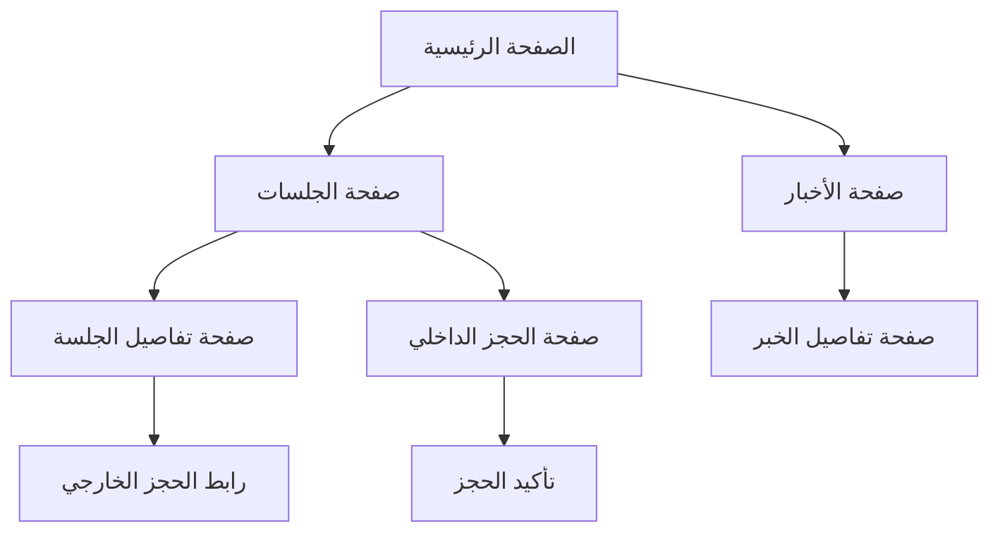

## 1. Product Overview
قسم المجتمع المتخصص في دعم مرضى سرطان الثدي في مصر، يوفر منصة شاملة لعرض جلسات الدعم والاستشارات مع إمكانية الحجز الإلكتروني والاطلاع على آخر الأخبار والموضوعات المتعلقة بالمرض.

يهدف المنتج إلى ربط المرضى بالمتخصصين وجلسات الدعم المتوفرة مع تسهيل عملية الوصول إلى المعلومات الطبية الموثوقة.

## 2. Core Features

### 2.1 User Roles
| الدور | طريقة التسجيل | الصلاحيات الأساسية |
|------|----------------|-------------------|
| المريض/المستخدم العادي | التسجيل بالبريد الإلكتروني أو رقم الهاتف | تصفح الجلسات، الحجز، قراءة الأخبار |
| المتخصص/الطبيب | التحقق من الشهادات الطبية | إضافة جلسات، إدارة الحجوزات |
| المدير | حساب إداري | إدارة جميع المحتوى، الموافقة على الجلسات |

### 2.2 Feature Module
يتكون قسم المجتمع من الصفحات الأساسية التالية:

1. **صفحة الجلسات**: عرض جميع جلسات الدعم المتاحة، تصفية حسب الموقع والتاريخ، نظام الحجز الإلكتروني.
2. **صفحة الأخبار**: آخر الأخبار والمستجدات حول سرطان الثدي، مقالات طبية، نصائح وإرشادات.
3. **صفحة تفاصيل الجلسة**: معلومات مفصلة عن الجلسة، الموعد، الموقع، رابط الحجز، ملفات تعريفية بالمختصين.

### 2.3 Page Details
| اسم الصفحة | اسم الوحدة | وصف الميزة |
|-----------|------------|------------|
| صفحة الجلسات | قائمة الجلسات | عرض جميع الجلسات المتاحة مع صور، تواريخ، أماكن، وسعة الجلسة |
| صفحة الجلسات | نظام التصفية | تصفية حسب الموقع (المحافظة)، نوع الجلسة، التاريخ، المتخصص |
| صفحة الجلسات | زر الحجز | زر واضح لكل جلسة يؤدي إلى صفحة الحجز أو رابط خارجي |
| صفحة الأخبار | بطاقات الأخبار | عرض المقالات بصيغة بطاقات مع صور، العناوين، وتواريخ النشر |
| صفحة الأخبار | تصنيفات الموضوعات | تصنيف المحتوى حسب النوع (أخبار، نصائح، قصص نجاح) |
| صفحة تفاصيل الجلسة | معلومات الجلسة | عرض التفاصيل الكاملة: الوقت، المدة، المكان، التكلفة إن وجدت |
| صفحة تفاصيل الجلسة | ملف المتخصص | صورة ونبذة عن المتخصص مع مؤهلاته وخبراته |
| صفحة تفاصيل الجلسة | رابط الحجز | زر واضح للحجز مع تأكيد عبر البريد أو الرسائل |

## 3. Core Process
### تدفق المستخدم العادي:
1. يدخل إلى صفحة الجلسات من القائمة الرئيسية
2. يتصفح الجلسات المتاحة ويستخدم أدوات التصفية
3. يختار جلسة مناسبة وينقر للحصول على التفاصيل
4. من صفحة التفاصيل، يضغط على زر الحجز
5. يتم توجيهه إلى رابط الحجز الخارجي أو نموذج الحجز الداخلي
6. يتلقى تأكيد بالحجز عبر البريد الإلكتروني أو الرسائل

### تدفق قراءة الأخبار:
1. يدخل إلى صفحة الأخبار من القائمة
2. يتصفح بطاقات الأخبار المصنفة
3. ينقر على خبر لقراءة التفاصيل الكاملة

## 4. User Interface Design

### 4.1 Design Style
- **الألوان الأساسية**: الوردي الفاتح (#FFB6C1) كرمز عالمي لسرطان الثدي، مع الأبيض والرمادي الفاتح
- **ألوان التأكيد**: الأخضر الفاتح لحالات النجاح والتأكيد
- **نمط الأزرار**: أزرار مستديرة الحواف مع ظلال خفيفة، تتغير عند المرور فوقها
- **الخطوط**: خطوط عربية حديثة مثل "Cairo" أو "Tajawal"، بحجم أساسي 16px
- **نمط التخطيط**: تصميم قائم على البطاقات مع فراغات مناسبة، شريط تنقل علوي ثابت
- **الأيقونات**: أيقونات خطية بسيطة مع استخدام رموز عالمية للصحة والدعم

### 4.2 Page Design Overview
| اسم الصفحة | اسم الوحدة | عناصر واجهة المستخدم |
|-----------|------------|---------------------|
| صفحة الجلسات | بطاقات الجلسات | تصميم شبكي responsive، كل بطاقة تحتوي على صورة الجلسة، العنوان، التاريخ، الموقع، عدد المقاعد المتاحة |
| صفحة الجلسات | شريط التصفية | قائمة منسدلة للمحافظات، أزرار اختيار لأنواع الجلسات، تقويم صغير لاختيار التاريخ |
| صفحة الأخبار | شبكة الأخبار | تخطيط شبكي مع بطاقات مختلفة الأحجام، البطاقة الكبيرة للخبر الرئيسي، بطاقات أصغر للأخبار الأخرى |
| صفحة تفاصيل الجلسة | القسم الرئيسي | صورة واسعة للجلسة، عنوان كبير، معلومات الجلسة في بطاقة بيضاء، خريطة صغيرة للموقع |
| صفحة تفاصيل الجلسة | قسم المتخصص | صورة دائرية للمتخصص، اسمه ومؤهلاته، تقييم نجوم إن وجد |

### 4.3 Responsiveness
- **تصميم أولي للسطح المكتب** مع تكيف تلقائي للأجهزة اللوحية والمحمولة
- **تحسين للمس**: أزرار أكبر حجمًا على الأجهزة المحمولة، مسافات مناسبة بين العناصر القابلة للنقر
- **قائمة متجاوبة**: شريط تنقل يتحول إلى قائمة همبرجر على الشاشات الصغيرة