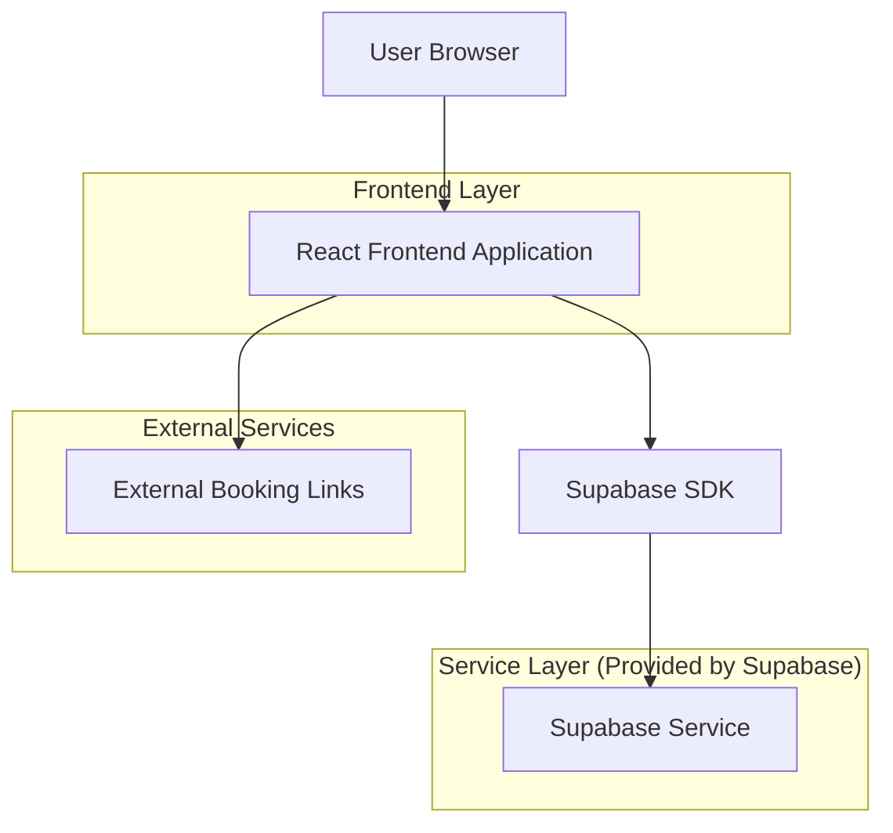
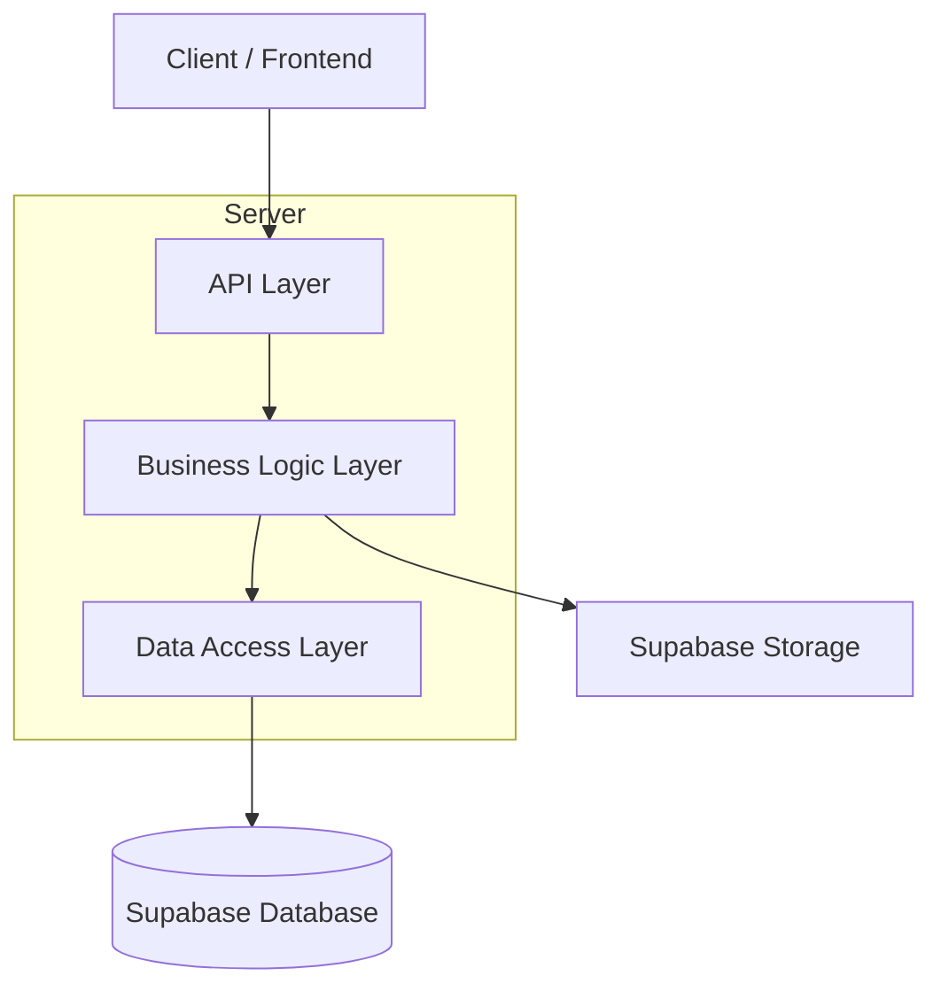
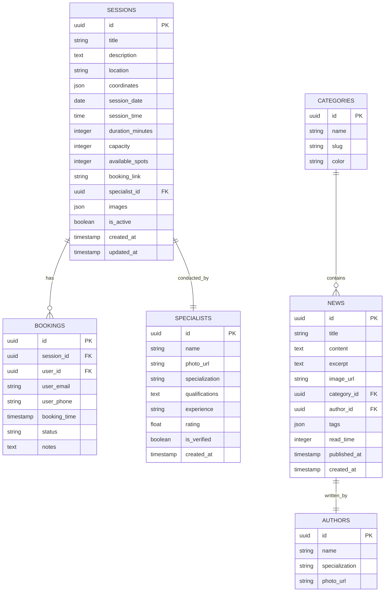

## 1. Architecture design



## 2. Technology Description

- **Frontend**: React@18 + tailwindcss@3 + vite
- **Initialization Tool**: vite-init
- **Backend**: Supabase (Authentication, Database, Storage)
- **State Management**: React Context API
- **Routing**: React Router v6

## 3. Route definitions

| Route | Purpose |
|-------|---------|
| /community | الصفحة الرئيسية لقسم المجتمع |
| /community/sessions | صفحة عرض جميع جلسات الدعم المتاحة |
| /community/sessions/:id | صفحة تفاصيل جلسة محددة |
| /community/news | صفحة عرض الأخبار والمقالات |
| /community/news/:id | صفحة تفاصيل خبر أو مقال |
| /community/booking/:sessionId | صفحة الحجز الداخلي (إن وجدت) |

## 4. API definitions

### 4.1 Sessions API

**Get All Sessions**
```
GET /api/sessions
```

Query Parameters:
| Param Name | Param Type | isRequired | Description |
|------------|------------|------------|-------------|
| location | string | false | Filter by governorate |
| type | string | false | Filter by session type |
| date | string | false | Filter by date (YYYY-MM-DD) |
| page | number | false | Pagination page number |
| limit | number | false | Items per page |

Response:
```json
{
  "sessions": [
    {
      "id": "uuid",
      "title": "جلسة دعم نفسي",
      "description": "وصف الجلسة",
      "location": "القاهرة",
      "date": "2024-01-15",
      "time": "14:00",
      "duration": 120,
      "capacity": 20,
      "available_spots": 15,
      "specialist": {
        "name": "د. أحمد محمد",
        "specialization": "طبيب نفسي"
      },
      "booking_link": "https://external-booking.com/session/123"
    }
  ],
  "total": 50,
  "page": 1,
  "totalPages": 5
}
```

**Get Session Details**
```
GET /api/sessions/:id
```

Response:
```json
{
  "id": "uuid",
  "title": "جلسة دعم نفسي",
  "description": "وصف مفصل للجلسة",
  "location": "العنوان التفصيلي",
  "coordinates": {
    "lat": 30.0444,
    "lng": 31.2357
  },
  "date": "2024-01-15",
  "time": "14:00",
  "duration": 120,
  "capacity": 20,
  "available_spots": 15,
  "specialist": {
    "id": "uuid",
    "name": "د. أحمد محمد",
    "photo": "https://storage.supabase.co/specialist-photo.jpg",
    "specialization": "طبيب نفسي",
    "qualifications": "دكتوراه في الطب النفسي",
    "experience": "15 سنة",
    "rating": 4.8
  },
  "booking_link": "https://external-booking.com/session/123",
  "images": ["https://storage.supabase.co/session-image1.jpg"]
}
```

### 4.2 News API

**Get All News**
```
GET /api/news
```

Query Parameters:
| Param Name | Param Type | isRequired | Description |
|------------|------------|------------|-------------|
| category | string | false | Filter by category |
| page | number | false | Pagination page number |
| limit | number | false | Items per page |

Response:
```json
{
  "news": [
    {
      "id": "uuid",
      "title": "اكتشاف جديد في علاج سرطان الثدي",
      "excerpt": "نبذة عن الخبر...",
      "image": "https://storage.supabase.co/news-image.jpg",
      "category": "أخبار طبية",
      "published_at": "2024-01-10",
      "read_time": 5
    }
  ],
  "total": 30,
  "page": 1,
  "totalPages": 3
}
```

**Get News Details**
```
GET /api/news/:id
```

Response:
```json
{
  "id": "uuid",
  "title": "اكتشاف جديد في علاج سرطان الثدي",
  "content": "المحتوى الكامل للخبر...",
  "image": "https://storage.supabase.co/news-image.jpg",
  "category": "أخبار طبية",
  "tags": ["علاج", "أبحاث", "سرطان الثدي"],
  "published_at": "2024-01-10",
  "read_time": 5,
  "author": {
    "name": "د. سارة أحمد",
    "specialization": "أخصائي أورام"
  }
}
```

## 5. Server architecture diagram



## 6. Data model

### 6.1 Data model definition



### 6.2 Data Definition Language

**Sessions Table**
```sql
-- create sessions table
CREATE TABLE sessions (
    id UUID PRIMARY KEY DEFAULT gen_random_uuid(),
    title VARCHAR(255) NOT NULL,
    description TEXT,
    location VARCHAR(255) NOT NULL,
    coordinates JSONB,
    session_date DATE NOT NULL,
    session_time TIME NOT NULL,
    duration_minutes INTEGER DEFAULT 60,
    capacity INTEGER DEFAULT 20,
    available_spots INTEGER DEFAULT 20,
    booking_link VARCHAR(500),
    specialist_id UUID REFERENCES specialists(id),
    images JSONB DEFAULT '[]',
    is_active BOOLEAN DEFAULT true,
    created_at TIMESTAMP WITH TIME ZONE DEFAULT NOW(),
    updated_at TIMESTAMP WITH TIME ZONE DEFAULT NOW()
);

-- create specialists table
CREATE TABLE specialists (
    id UUID PRIMARY KEY DEFAULT gen_random_uuid(),
    name VARCHAR(255) NOT NULL,
    photo_url VARCHAR(500),
    specialization VARCHAR(255) NOT NULL,
    qualifications TEXT,
    experience VARCHAR(100),
    rating FLOAT DEFAULT 0,
    is_verified BOOLEAN DEFAULT false,
    created_at TIMESTAMP WITH TIME ZONE DEFAULT NOW()
);

-- create categories table
CREATE TABLE categories (
    id UUID PRIMARY KEY DEFAULT gen_random_uuid(),
    name VARCHAR(100) NOT NULL,
    slug VARCHAR(100) UNIQUE NOT NULL,
    color VARCHAR(7) DEFAULT '#FFB6C1',
    created_at TIMESTAMP WITH TIME ZONE DEFAULT NOW()
);

-- create authors table
CREATE TABLE authors (
    id UUID PRIMARY KEY DEFAULT gen_random_uuid(),
    name VARCHAR(255) NOT NULL,
    specialization VARCHAR(255),
    photo_url VARCHAR(500),
    created_at TIMESTAMP WITH TIME ZONE DEFAULT NOW()
);

-- create news table
CREATE TABLE news (
    id UUID PRIMARY KEY DEFAULT gen_random_uuid(),
    title VARCHAR(255) NOT NULL,
    content TEXT NOT NULL,
    excerpt VARCHAR(500),
    image_url VARCHAR(500),
    category_id UUID REFERENCES categories(id),
    author_id UUID REFERENCES authors(id),
    tags JSONB DEFAULT '[]',
    read_time INTEGER DEFAULT 5,
    published_at TIMESTAMP WITH TIME ZONE DEFAULT NOW(),
    created_at TIMESTAMP WITH TIME ZONE DEFAULT NOW()
);

-- create bookings table
CREATE TABLE bookings (
    id UUID PRIMARY KEY DEFAULT gen_random_uuid(),
    session_id UUID REFERENCES sessions(id),
    user_id UUID,
    user_email VARCHAR(255) NOT NULL,
    user_phone VARCHAR(20),
    booking_time TIMESTAMP WITH TIME ZONE DEFAULT NOW(),
    status VARCHAR(20) DEFAULT 'confirmed',
    notes TEXT,
    created_at TIMESTAMP WITH TIME ZONE DEFAULT NOW()
);

-- create indexes
CREATE INDEX idx_sessions_date ON sessions(session_date);
CREATE INDEX idx_sessions_location ON sessions(location);
CREATE INDEX idx_sessions_active ON sessions(is_active);
CREATE INDEX idx_news_published ON news(published_at DESC);
CREATE INDEX idx_news_category ON news(category_id);
CREATE INDEX idx_bookings_session ON bookings(session_id);
CREATE INDEX idx_bookings_user ON bookings(user_id);

-- set up Row Level Security (RLS)
ALTER TABLE sessions ENABLE ROW LEVEL SECURITY;
ALTER TABLE specialists ENABLE ROW LEVEL SECURITY;
ALTER TABLE news ENABLE ROW LEVEL SECURITY;
ALTER TABLE bookings ENABLE ROW LEVEL SECURITY;

-- create policies
-- Sessions: public read, admin write
CREATE POLICY "Sessions are viewable by everyone" ON sessions
    FOR SELECT USING (is_active = true);

CREATE POLICY "Sessions can be created by admins" ON sessions
    FOR INSERT WITH CHECK (true);

-- News: public read, admin write
CREATE POLICY "News are viewable by everyone" ON news
    FOR SELECT USING (published_at <= NOW());

-- Bookings: authenticated users can create and view their own
CREATE POLICY "Users can create bookings" ON bookings
    FOR INSERT WITH CHECK (true);

CREATE POLICY "Users can view their own bookings" ON bookings
    FOR SELECT USING (user_id = auth.uid());

-- Grant permissions
GRANT SELECT ON sessions TO anon;
GRANT SELECT ON sessions TO authenticated;
GRANT SELECT ON specialists TO anon;
GRANT SELECT ON specialists TO authenticated;
GRANT SELECT ON news TO anon;
GRANT SELECT ON news TO authenticated;
GRANT SELECT ON categories TO anon;
GRANT SELECT ON categories TO authenticated;
GRANT SELECT ON authors TO anon;
GRANT SELECT ON authors TO authenticated;
GRANT ALL ON bookings TO authenticated;

-- insert initial data
INSERT INTO categories (name, slug, color) VALUES
    ('أخبار طبية', 'medical-news', '#FF6B6B'),
    ('نصائح وإرشادات', 'tips-guidance', '#4ECDC4'),
    ('قصص نجاح', 'success-stories', '#45B7D1'),
    ('علاج ودواء', 'treatment-medication', '#96CEB4');

INSERT INTO specialists (name, photo_url, specialization, qualifications, experience, rating, is_verified) VALUES
    ('د. أحمد محمد', 'https://example.com/dr-ahmed.jpg', 'طبيب نفسي', 'دكتوراه في الطب النفسي - جامعة القاهرة', '15 سنة', 4.8, true),
    ('د. سارة أحمد', 'https://example.com/dr-sara.jpg', 'أخصائي أورام', 'دكتوراه في الأورام - جامعة عين شمس', '12 سنة', 4.9, true);
```