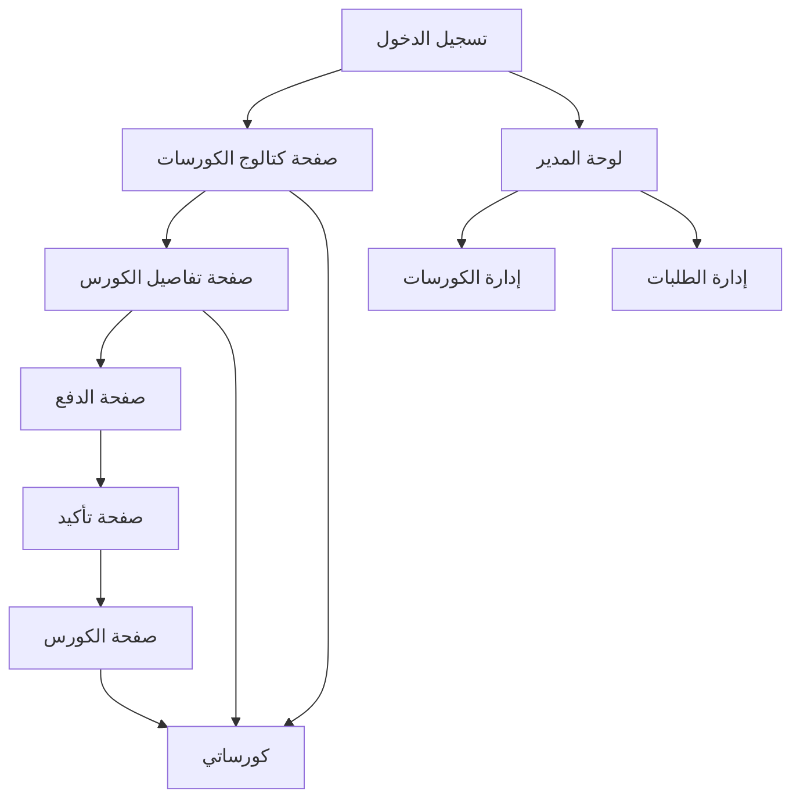

# نظام شراء الكورسات - Education Hub

## 1. نظرة عامة على المنتج
نظام متكامل لشراء الكورسات التعليمية داخل Education Hub، يتيح للطلاب استعراض الكورسات، شراؤها، والوصول إلى المحتوى التعليمي. يهدف إلى تبسيط عملية التعلم الإلكتروني وتوفير تجربة شراء سلسة للمستخدمين.

## 2. المميزات الأساسية

### 2.1 أدوار المستخدمين
| الدور | طريقة التسجيل | الصلاحيات الأساسية |
|------|----------------|-------------------|
| المستخدم العادي | التسجيل بالبريد الإلكتروني | استعراض الكورسات، الشراء، الوصول للمحتوى |
| المدير | تعيين من قبل النظام | إدارة الكورسات، المستخدمين، الطلبات، والمحتوى |

### 2.2 وحدات الميزات
يتكون نظام شراء الكورسات من الصفحات الرئيسية التالية:
1. **كتالوج الكورسات**: عرض جميع الكورسات المتاحة مع تصفية وبحث
2. **صفحة تفاصيل الكورس**: معلومات مفصلة، محتوى الكورس، والشراء
3. **صفحة الدفع**: معالجة الدفع عبر Stripe
4. **كورساتي**: لوحة تحكم بالكورسات المشتراة والتقدم
5. **صفحة الكورس**: الوصول للدروس ومشاهدة المحتوى
6. **صفحة تسجيل الدخول/التسجيل**: المصادقة والوصول للنظام

### 2.3 تفاصيل الصفحات
| اسم الصفحة | اسم الوحدة | وصف الميزة |
|-----------|------------|------------|
| كتالوج الكورسات | قائمة الكورسات | عرض شبكي للكورسات مع صورة العرض، العنوان، السعر، والتقييم |
| كتالوج الكورسات | تصفية وبحث | تصفية حسب التصنيف، السعر، المستوى، والبحث بالكلمات المفتاحية |
| كتالوج الكورسات | نظام التقييم | عرض متوسط التقييمات وعدد الطلاب المسجلين |
| صفحة تفاصيل الكورس | معلومات الكورس | عرض عنوان الكورس، الوصف، المدة، المستوى، والمتطلبات |
| صفحة تفاصيل الكورس | محتوى الكورس | قائمة بالوحدات والدروس مع مدة كل درس |
| صفحة تفاصيل الكورس | معلومات المدرب | صورة المدرب، السيرة الذاتية، وتقييماته |
| صفحة تفاصيل الكورس | زر الشراء | زر مميز للانتقال لصفحة الدفع |
| صفحة الدفع | نموذج الدفع | حقول إدخال معلومات البطاقة الائتمانية |
| صفحة الدفع | معالجة الدفع | دمج مع Stripe لمعالجة المدفوعات بأمان |
| صفحة الدفع | تأكيد الطلب | عرض تفاصيل الطلب والمبلغ المدفوع |
| كورساتي | لوحة التحكم | عرض الكورسات المشتراة مع تقدم التعلم |
| كورساتي | تتبع التقدم | شريط تقدم لكل كورس يوضح نسبة الإكمال |
| كورساتي | آخر النشاطات | عرض آخر الدروس المشاهدة والوقت المستغرق |
| صفحة الكورس | مشغل الفيديو | مشغل فيديو متقدم مع خيارات الجودة والسرعة |
| صفحة الكورس | قائمة الدروس | قائمة جانبية بجميع الدروس مع علامة الإكمال |
| صفحة الكورس | ملاحظات ومناقشة | قسم للمناقشة والأسئلة تحت كل درس |
| تسجيل الدخول/التسجيل | نموذج المصادقة | حقول إدخال البريد الإلكتروني وكلمة المرور |
| تسجيل الدخول/التسجيل | دعم اللغات | التبديل بين العربية والإنجليزية |

## 3. العمليات الأساسية

### تدفق المستخدم العادي:
1. يتصفح المستخدم كتالوج الكورسات
2. يختار كورس معين لعرض التفاصيل
3. يقرر الشراء وينتقل لصفحة الدفع
4. يدخل معلومات الدفع ويأكد الطلب
5. يتم التوجيه لصفحة الكورس بعد النجاح
6. يمكنه الوصول للكورس من "كورساتي"

### تدفق المدير:
1. يسجل الدخول بحساب المدير
2. يدخل لوحة التحكم الإدارية
3. يضيف/يعدل الكورسات والمحتوى
4. يتابع الطلبات والمدفوعات
5. يدير المستخدمين والتقييمات

## 4. تصميم واجهة المستخدم

### 4.1 أسلوب التصميم
- **الألوان الأساسية**: أزرق (#2563EB) وأبيض مع تدرجات رمادية
- **الألوان الثانوية**: أخضر (#10B981) للنجاح، أحمر (#EF4444) للأخطاء
- **أسلوب الأزرار**: مستديرة الزوايا مع ظلال خفيفة
- **الخطوط**: Tajawal للعربية، Inter للإنجليزية، مقاس 16px للنص الأساسي
- **أسلوب التخطيط**: تصميم شبكي مع كروت حديثة
- **الأيقونات**: أيقونات خطية بسيطة مع دعم الإيموجي

### 4.2 نظرة عامة على تصميم الصفحات
| اسم الصفحة | اسم الوحدة | عناصر واجهة المستخدم |
|-----------|------------|----------------------|
| كتالوج الكورسات | شبكة الكورسات | تخطيط 3x2 على سطح المكتب، بطاقات بظلال خفيفة، صور عرض 16:9 |
| كتالوج الكورسات | شريط البحث | حقل بحث واسع مع أيقونة، أزرار تصفية جانبية |
| صفحة تفاصيل الكورس | قسم الفيديو | مشغل فيديو كبير مع صورة عرض الكورس |
| صفحة تفاصيل الكورس | معلومات الكورس | عنوان كبير، وصف مفصل، قائمة النقاط الرئيسية |
| صفحة الدفع | نموذج الدفع | حقول منظمة، أيقونات بطاقات ائتمان، زر شراء مميز |
| كورساتي | بطاقات التقدم | بطاقات صغيرة مع أشرطة تقدم ملونة ونسب مئوية |
| صفحة الكورس | منطقة الفيديو | مشغل فيديو كامل العرض مع قائمة دروس جانبية قابلة للطي |

### 4.3 التجاوبية
- التصميم الأساسي: سطح المكتب أولاً
- التكيف مع الأجهزة اللوحية: تخطيط 2x2 للشبكة
- التكيف مع الهواتف: تخطيط عمودي 1x1 مع قائمة تبديل
- تحسين التفاعل باللمس: أزرار أكبر، مسافات بين العناصر

### 4.4 دعم اللغات
- **العربية**: تخطيط من اليمين لليسار، الخطوط العربية المناسبة
- **الإنجليزية**: تخطيط من اليسار لليمين، الخطوط اللاتينية
- **التبديل**: زر تبديل لغة واضح في الشريط العلوي
- **التوطين**: تنسيق الأرقام والتواريخ حسب اللغة المختارة