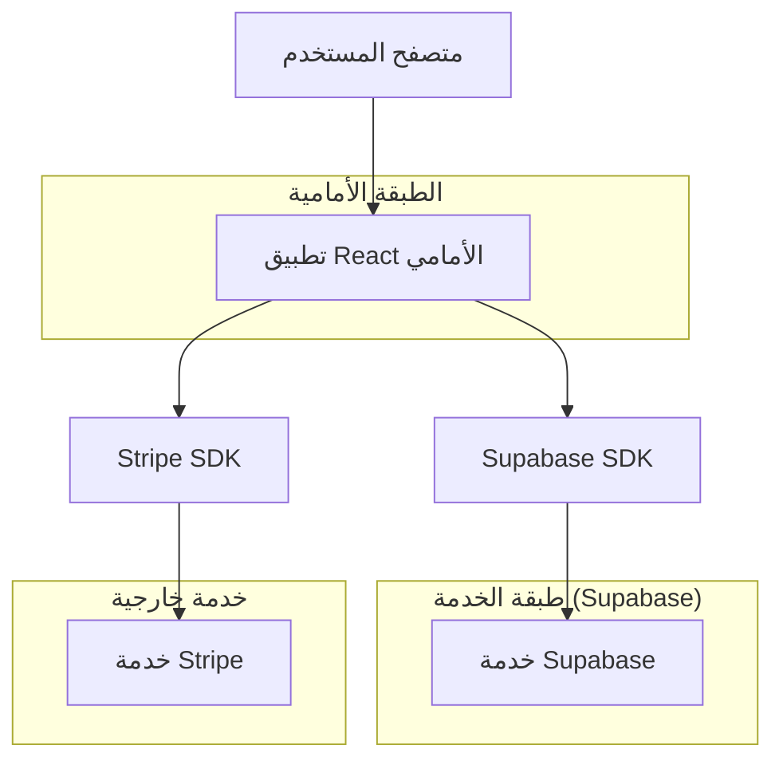
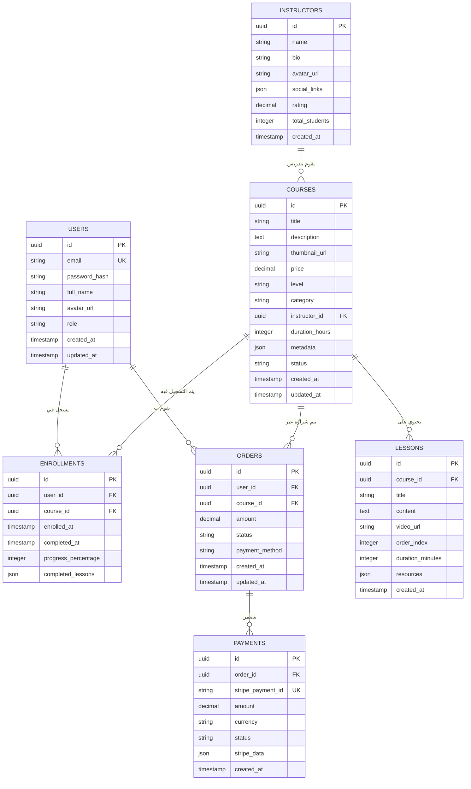

# هيكل تقني لنظام شراء الكورسات - Education Hub

## 1. تصميم البنية



## 2. وصف التكنولوجيا
- **الواجهة الأمامية**: React@18 + tailwindcss@3 + vite
- **أداة التهيئة**: vite-init
- **قاعدة البيانات**: Supabase (PostgreSQL)
- **المصادقة**: Supabase Auth
- **الدفع**: Stripe Integration
- **الترجمة**: react-i18next

## 3. تعريفات المسارات
| المسار | الغرض |
|-------|---------|
| / | الصفحة الرئيسية، عرض كتالوج الكورسات |
| /courses/:id | صفحة تفاصيل الكورس |
| /checkout/:courseId | صفحة الدفع والشراء |
| /my-courses | لوحة "كورساتي" بالكورسات المشتراة |
| /course/:id/learn | صفحة مشاهدة الكورس والدروس |
| /login | صفحة تسجيل الدخول |
| /register | صفحة التسجيل الجديد |
| /admin/dashboard | لوحة تحكم المدير |
| /admin/courses | إدارة الكورسات |
| /admin/orders | إدارة الطلبات |

## 4. تعريفات واجهة برمجة التطبيقات

### 4.1 واجهات Supabase

**جلب الكورسات**
```typescript
// استعلام جلب الكورسات مع التصفية
const { data: courses, error } = await supabase
  .from('courses')
  .select(`
    *,
    instructor:instructor_id(name, avatar),
    enrollments_count
  `)
  .eq('status', 'published')
  .range(start, end)
```

**شراء الكورس**
```typescript
// إنشاء طلب شراء جديد
const { data: order } = await supabase
  .from('orders')
  .insert({
    user_id: user.id,
    course_id: courseId,
    amount: coursePrice,
    status: 'pending'
  })
  .single()
```

**التحقق من الشراء**
```typescript
// التحقق من شراء المستخدم للكورس
const { data: enrollment } = await supabase
  .from('enrollments')
  .select('*')
  .eq('user_id', userId)
  .eq('course_id', courseId)
  .single()
```

### 4.2 واجهات Stripe

**إنشاء جلسة Checkout**
```typescript
// إنشاء جلسة دفع Stripe
const session = await stripe.checkout.sessions.create({
  payment_method_types: ['card'],
  line_items: [{
    price_data: {
      currency: 'usd',
      product_data: {
        name: courseTitle,
        images: [courseImage],
      },
      unit_amount: coursePrice * 100, // بالسنت
    },
    quantity: 1,
  }],
  mode: 'payment',
  success_url: `${origin}/success?session_id={CHECKOUT_SESSION_ID}`,
  cancel_url: `${origin}/course/${courseId}`,
})
```

## 5. نموذج البيانات

### 5.1 تعريف نموذج البيانات



### 5.2 لغة تعريف البيانات

**جدول المستخدمين (users)**
```sql
-- إنشاء الجدول
CREATE TABLE users (
    id UUID PRIMARY KEY DEFAULT gen_random_uuid(),
    email VARCHAR(255) UNIQUE NOT NULL,
    password_hash VARCHAR(255) NOT NULL,
    full_name VARCHAR(100) NOT NULL,
    avatar_url TEXT,
    role VARCHAR(20) DEFAULT 'user' CHECK (role IN ('user', 'admin')),
    created_at TIMESTAMP WITH TIME ZONE DEFAULT NOW(),
    updated_at TIMESTAMP WITH TIME ZONE DEFAULT NOW()
);

-- إنشاء الفهارس
CREATE INDEX idx_users_email ON users(email);
CREATE INDEX idx_users_role ON users(role);
```

**جدول الكورسات (courses)**
```sql
-- إنشاء جدول الكورسات
CREATE TABLE courses (
    id UUID PRIMARY KEY DEFAULT gen_random_uuid(),
    title VARCHAR(255) NOT NULL,
    description TEXT,
    thumbnail_url TEXT,
    price DECIMAL(10,2) NOT NULL DEFAULT 0,
    level VARCHAR(20) CHECK (level IN ('beginner', 'intermediate', 'advanced')),
    category VARCHAR(50),
    instructor_id UUID REFERENCES instructors(id),
    duration_hours INTEGER DEFAULT 0,
    metadata JSONB DEFAULT '{}',
    status VARCHAR(20) DEFAULT 'draft' CHECK (status IN ('draft', 'published', 'archived')),
    created_at TIMESTAMP WITH TIME ZONE DEFAULT NOW(),
    updated_at TIMESTAMP WITH TIME ZONE DEFAULT NOW()
);

-- إنشاء الفهارس
CREATE INDEX idx_courses_status ON courses(status);
CREATE INDEX idx_courses_category ON courses(category);
CREATE INDEX idx_courses_price ON courses(price);
CREATE INDEX idx_courses_instructor ON courses(instructor_id);
```

**جدول التسجيلات (enrollments)**
```sql
-- إنشاء جدول التسجيلات
CREATE TABLE enrollments (
    id UUID PRIMARY KEY DEFAULT gen_random_uuid(),
    user_id UUID REFERENCES users(id) ON DELETE CASCADE,
    course_id UUID REFERENCES courses(id) ON DELETE CASCADE,
    enrolled_at TIMESTAMP WITH TIME ZONE DEFAULT NOW(),
    completed_at TIMESTAMP WITH TIME ZONE,
    progress_percentage INTEGER DEFAULT 0 CHECK (progress_percentage >= 0 AND progress_percentage <= 100),
    completed_lessons JSONB DEFAULT '[]',
    UNIQUE(user_id, course_id)
);

-- إنشاء الفهارس
CREATE INDEX idx_enrollments_user ON enrollments(user_id);
CREATE INDEX idx_enrollments_course ON enrollments(course_id);
CREATE INDEX idx_enrollments_progress ON enrollments(progress_percentage);
```

**جدول الطلبات (orders)**
```sql
-- إنشاء جدول الطلبات
CREATE TABLE orders (
    id UUID PRIMARY KEY DEFAULT gen_random_uuid(),
    user_id UUID REFERENCES users(id) ON DELETE CASCADE,
    course_id UUID REFERENCES courses(id) ON DELETE CASCADE,
    amount DECIMAL(10,2) NOT NULL,
    status VARCHAR(20) DEFAULT 'pending' CHECK (status IN ('pending', 'completed', 'failed', 'cancelled')),
    payment_method VARCHAR(50),
    created_at TIMESTAMP WITH TIME ZONE DEFAULT NOW(),
    updated_at TIMESTAMP WITH TIME ZONE DEFAULT NOW()
);

-- إنشاء الفهارس
CREATE INDEX idx_orders_user ON orders(user_id);
CREATE INDEX idx_orders_course ON orders(course_id);
CREATE INDEX idx_orders_status ON orders(status);
CREATE INDEX idx_orders_created ON orders(created_at);
```

### 5.3 سياسات الأمان Supabase

**سياسات الوصول الأساسية**
```sql
-- منح صلاحيات القراءة للمستخدمين المجهولين
GRANT SELECT ON courses TO anon;
GRANT SELECT ON instructors TO anon;

-- منح صلاحيات كاملة للمستخدمين المصدق عليهم
GRANT ALL PRIVILEGES ON courses TO authenticated;
GRANT ALL PRIVILEGES ON enrollments TO authenticated;
GRANT ALL PRIVILEGES ON orders TO authenticated;
GRANT ALL PRIVILEGES ON payments TO authenticated;

-- سياسات RLS للحماية
ALTER TABLE courses ENABLE ROW LEVEL SECURITY;
ALTER TABLE enrollments ENABLE ROW LEVEL SECURITY;
ALTER TABLE orders ENABLE ROW LEVEL SECURITY;

-- سياسة: المستخدمون يمكنهم رؤية الكورسات المنشورة فقط
CREATE POLICY "Published courses are viewable" ON courses
    FOR SELECT USING (status = 'published');

-- سياسة: المستخدمون يمكنهم رؤية تسجيلاتهم فقط
CREATE POLICY "Users can view own enrollments" ON enrollments
    FOR SELECT USING (auth.uid() = user_id);

-- سياسة: المستخدمون يمكنهم إنشاء تسجيلات لأنفسهم
CREATE POLICY "Users can create own enrollments" ON enrollments
    FOR INSERT WITH CHECK (auth.uid() = user_id);
```

## 6. تكامل Stripe

### 6.1 إعداد Webhook
```typescript
// معالج webhook للتأكيدات الناجحة
export async function handleStripeWebhook(event: Stripe.Event) {
  switch (event.type) {
    case 'checkout.session.completed':
      const session = event.data.object as Stripe.Checkout.Session
      await handleSuccessfulPayment(session)
      break
    case 'payment_intent.succeeded':
      // معالجة النجاح الإضافية
      break
  }
}

async function handleSuccessfulPayment(session: Stripe.Checkout.Session) {
  // تحديث حالة الطلب
  const { error } = await supabase
    .from('orders')
    .update({ status: 'completed' })
    .eq('id', session.metadata.orderId)
  
  // إنشاء تسجيل للكورس
  await supabase.from('enrollments').insert({
    user_id: session.metadata.userId,
    course_id: session.metadata.courseId,
    enrolled_at: new Date().toISOString()
  })
}
```

### 6.2 مفاتيح البيئة المطلوبة
```bash
# Stripe Configuration
VITE_STRIPE_PUBLISHABLE_KEY=pk_test_...
STRIPE_SECRET_KEY=sk_test_...
STRIPE_WEBHOOK_SECRET=whsec_...

# Supabase Configuration
VITE_SUPABASE_URL=https://your-project.supabase.co
VITE_SUPABASE_ANON_KEY=your-anon-key
SUPABASE_SERVICE_KEY=your-service-key
```