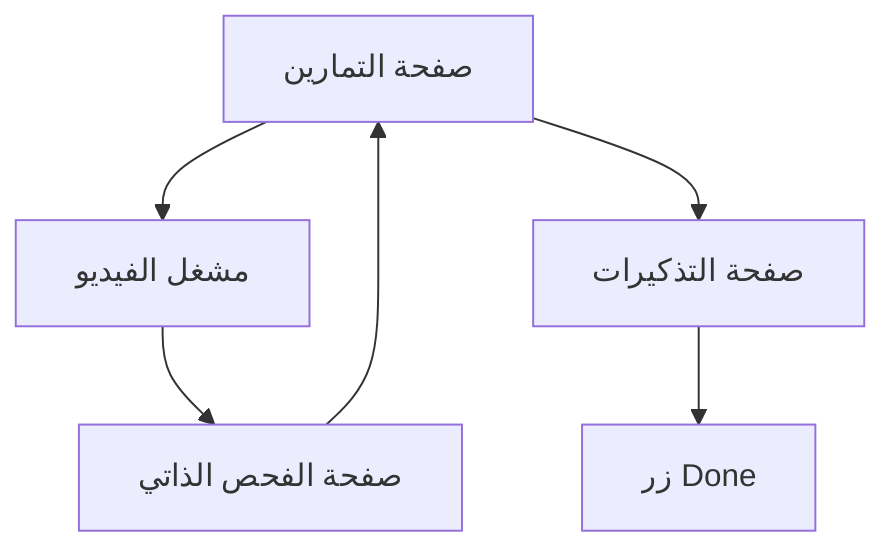

## 1. نظرة عامة على المنتج
تطبيق ويب لتتبع الصحة يوفر تمارين فيديو مع فحص ذاتي، وتذكيرات منتظمة للماء والدواء. يهدف إلى مساعدة المستخدمين في الحفاظ على روتين صحي منتظم من خلال واجهة موثوقة ومقيدة بإجابات Rasa فقط.

## 2. الميزات الأساسية

### 2.1 أدوار المستخدمين
| الدور | طريقة التسجيل | الصلاحيات الأساسية |
|------|----------------|-------------------|
| مستخدم عادي | تسجيل بريد إلكتروني | تصفح التمارين، تسجيل الفحص الذاتي، تلقي التذكيرات |

### 2.2 وحدات الميزات
يتكون التطبيق من الصفحات الأساسية التالية:
1. **صفحة التمارين**: عرض قائمة التمارين، مشغل الفيديو مع كتم الصوت الافتراضي، مساحة ملاحظات.
2. **صفحة الفحص الذاتي**: نموذج الإجابة على أسئلة Rasa، حفظ النتائج.
3. **صفحة التذكيرات**: عرض تذكيرات الماء والدواء، زر "Done" للإشارة بالإكمال.
4. **صفحة الإعدادات**: إدارة أوقات التذكير، إعدادات الفيديو.

### 2.3 تفاصيل الصفحات
| اسم الصفحة | اسم الوحدة | وصف الميزة |
|-----------|------------|------------|
| صفحة التمارين | قائمة التمارين | عرض التمارين المتاحة مع صور مصغرة وأسماء |
| صفحة التمارين | مشغل الفيديو | تشغيل الفيديو مع كتم صوت افتراضي، أزرار التحكم |
| صفحة التمارين | مساحة الملاحظات | حقل نص لتسجيل ملاحظات عن التمرين |
| صفحة التمارين | أصول قابلة للتهيئة | مجلد assets للفيديوهات القابلة للإضافة |
| صفحة الفحص الذاتي | نموذج Rasa | عرض أسئلة مقيدة بإجابات Rasa فقط |
| صفحة الفحص الذاتي | حفظ النتائج | تسجيل إجابات الفحص الذاتي |
| صفحة التذكيرات | تذكير الماء | إشعار كل ساعة مع رابط لصفحة التأكيد |
| صفحة التذكيرات | تذكير الدواء | إشعار حسب الجدول الزمني مع رابط لصفحة التأكيد |
| صفحة التذكيرات | زر Done | زر للإشارة بشرب الماء أو تناول الدواء |

## 3. العمليات الأساسية
### تدفق المستخدم الأساسي:
1. يبدأ المستخدم من صفحة التمارين لاختيار تمرين مناسب
2. يشاهد الفيديو بصوت مكتوم ويكتب ملاحظاته
3. ينتقل لصفحة الفحص الذاتي للإجابة على أسئلة Rasa
4. يتلقى تذكيرات منتظمة بالماء كل ساعة
5. عند التذكير، ينتقل لصفحة التأكيد ويضغط Done

## 4. تصميم واجهة المستخدم
### 4.1 نمط التصميم
- الألوان الأساسية: أزرق صحي (#4A90E2) مع خلفية بيضاء
- أزرار: تصميم مستدير مع ظلال خفيفة
- الخط: Arial أو Helvetica، حجم 16px للنص الأساسي
- نمط التخطيط: بطاقات مع شريط تنقل علوي
- أيقونات: أيقونات طبية بسيطة (💧💊🏃‍♂️)

### 4.2 نظرة عامة على تصميم الصفحات
| اسم الصفحة | اسم الوحدة | عناصر واجهة المستخدم |
|-----------|------------|---------------------|
| صفحة التمارين | قائمة التمارين | شبكة من البطاقات مع صور مصغرة، أسماء التمارين |
| صفحة التمارين | مشغل الفيديو | مشغل فيديو كبير، زر كتم/تشغيل الصوت، شريط تقدم |
| صفحة التمارين | مساحة الملاحظات | حقل نص متعدد الأسطر، زر حفظ |
| صفحة الفحص الذاتي | نموذج Rasa | قائمة منسدلة بإجابات Rasa، زر إرسال |
| صفحة التذكيرات | تذكير الماء | بطاقة زرقاء مع أيقونة الماء، زر Done أخضر |
| صفحة التذكيرات | تذكير الدواء | بطاقة برتقالية مع أيقونة الدواء، زر Done أخضر |

### 4.3 التجاوبية
تصميم أول للكمبيوتر المكتبي مع تكيف للجوال، مع تحسين للتفاعل باللمس.

### 4.4 إرشادات المشهد ثلاثي الأبعاد (غير applicable)
لا يتضمن التطبيق محتوى ثلاثي الأبعاد.