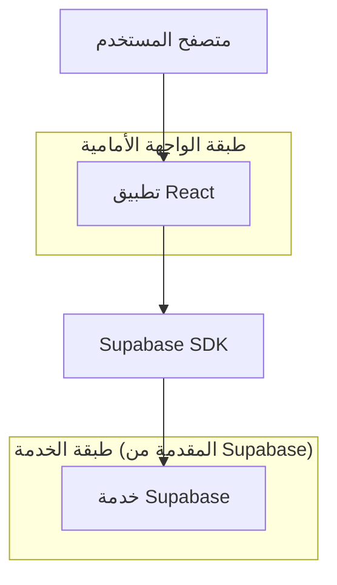
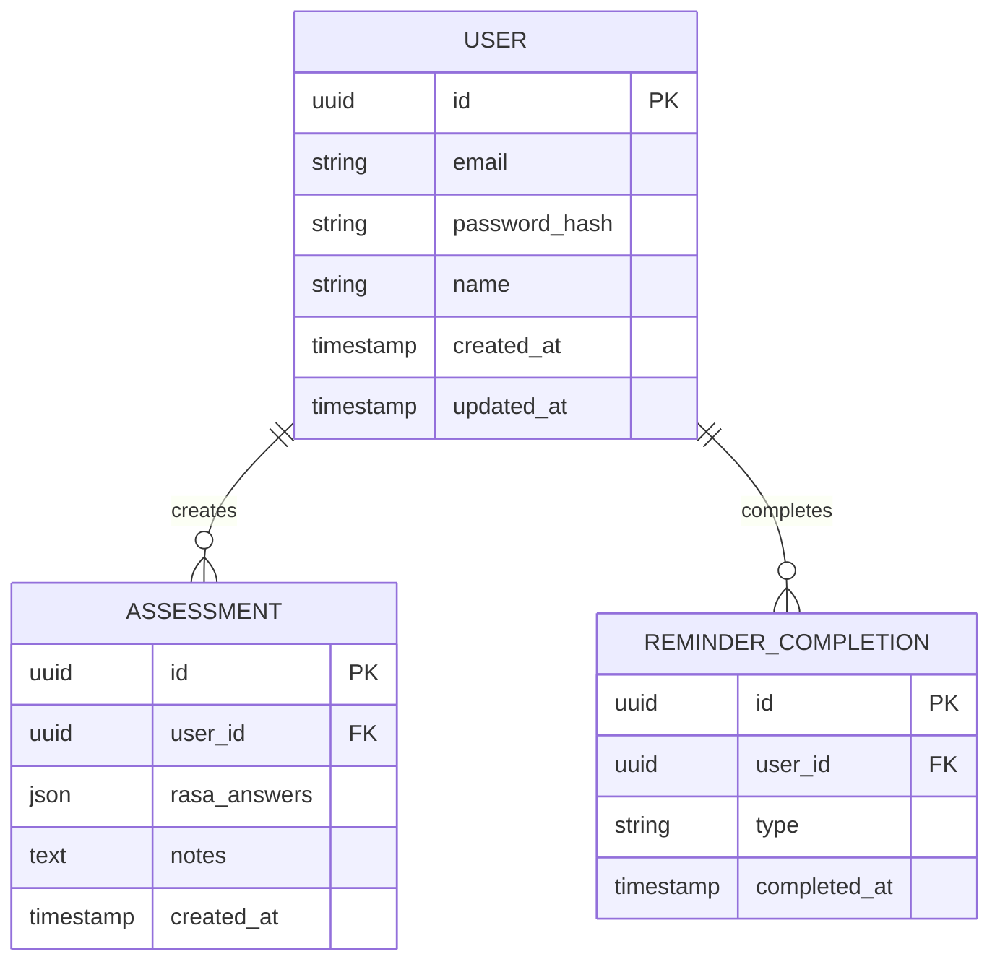

## 1. تصميم المعمارية



## 2. وصف التكنولوجيا
- الواجهة الأمامية: React@18 + tailwindcss@3 + vite
- أداة التهيئة: vite-init
- الخلفية: Supabase (للتوثيق، قاعدة البيانات، التخزين)

## 3. تعريفات المسارات
| المسار | الغرض |
|-------|---------|
| / | صفحة التمارين الرئيسية |
| /assessment | صفحة الفحص الذاتي |
| /reminders | صفحة التذكيرات |
| /settings | صفحة الإعدادات |

## 4. تعريفات واجهة برمجة التطبيقات

### 4.1 واجهة برمجة التطبيقات الأساسية

**توثيق المستخدم**
```
POST /api/auth/login
```

الطلب:
| اسم المعامل| نوع المعامل | مطلوب | الوصف |
|-----------|-------------|--------|---------|
| email | string | true | بريد المستخدم الإلكتروني |
| password | string | true | كلمة المرور |

الاستجابة:
| اسم المعامل| نوع المعامل | الوصف |
|-----------|-------------|---------|
| user | object | بيانات المستخدم |
| session | object | جلسة التوثيق |

**حفظ نتائج الفحص الذاتي**
```
POST /api/assessment/save
```

الطلب:
| اسم المعامل| نوع المعامل | مطلوب | الوصف |
|-----------|-------------|--------|---------|
| user_id | string | true | معرف المستخدم |
| rasa_answers | array | true | إجابات Rasa |
| notes | string | false | ملاحظات إضافية |

**تسجيل إكمال التذكير**
```
POST /api/reminders/complete
```

الطلب:
| اسم المعامل| نوع المعامل | مطلوب | الوصف |
|-----------|-------------|--------|---------|
| user_id | string | true | معرف المستخدم |
| type | string | true | نوع التذكير (water/medication) |
| timestamp | datetime | true | وقت الإكمال |

## 5. مخطط معمارية الخادم (غير applicable)
لا يتضمن التطبيق خادم مخصص حيث تتم جميع العمليات عبر Supabase.

## 6. نموذج البيانات

### 6.1 تعريف نموذج البيانات



### 6.2 لغة تعريف البيانات

**جدول المستخدمين (users)**
```sql
-- إنشاء الجدول
CREATE TABLE users (
    id UUID PRIMARY KEY DEFAULT gen_random_uuid(),
    email VARCHAR(255) UNIQUE NOT NULL,
    password_hash VARCHAR(255) NOT NULL,
    name VARCHAR(100) NOT NULL,
    created_at TIMESTAMP WITH TIME ZONE DEFAULT NOW(),
    updated_at TIMESTAMP WITH TIME ZONE DEFAULT NOW()
);

-- إنشاء فهارس
CREATE INDEX idx_users_email ON users(email);
```

**جدول الفحص الذاتي (assessments)**
```sql
-- إنشاء الجدول
CREATE TABLE assessments (
    id UUID PRIMARY KEY DEFAULT gen_random_uuid(),
    user_id UUID REFERENCES users(id) ON DELETE CASCADE,
    rasa_answers JSONB NOT NULL,
    notes TEXT,
    created_at TIMESTAMP WITH TIME ZONE DEFAULT NOW()
);

-- إنشاء فهارس
CREATE INDEX idx_assessments_user_id ON assessments(user_id);
CREATE INDEX idx_assessments_created_at ON assessments(created_at DESC);
```

**جدول إكمال التذكيرات (reminder_completions)**
```sql
-- إنشاء الجدول
CREATE TABLE reminder_completions (
    id UUID PRIMARY KEY DEFAULT gen_random_uuid(),
    user_id UUID REFERENCES users(id) ON DELETE CASCADE,
    type VARCHAR(20) NOT NULL CHECK (type IN ('water', 'medication')),
    completed_at TIMESTAMP WITH TIME ZONE DEFAULT NOW()
);

-- إنشاء فهارس
CREATE INDEX idx_reminder_completions_user_id ON reminder_completions(user_id);
CREATE INDEX idx_reminder_completions_type ON reminder_completions(type);
```

**سياسات الأمان في Supabase**
```sql
-- منح صلاحيات الوصول للمستخدمين غير الموثقين
GRANT SELECT ON exercises TO anon;
GRANT SELECT ON exercises TO authenticated;

-- منح صلاحيات كاملة للمستخدمين الموثقين
GRANT ALL PRIVILEGES ON assessments TO authenticated;
GRANT ALL PRIVILEGES ON reminder_completions TO authenticated;

-- سياسات الوصول للبيانات
CREATE POLICY "Users can view their own assessments" ON assessments
    FOR SELECT USING (auth.uid() = user_id);

CREATE POLICY "Users can create their own assessments" ON assessments
    FOR INSERT WITH CHECK (auth.uid() = user_id);

CREATE POLICY "Users can view their own completions" ON reminder_completions
    FOR SELECT USING (auth.uid() = user_id);

CREATE POLICY "Users can create their own completions" ON reminder_completions
    FOR INSERT WITH CHECK (auth.uid() = user_id);
```