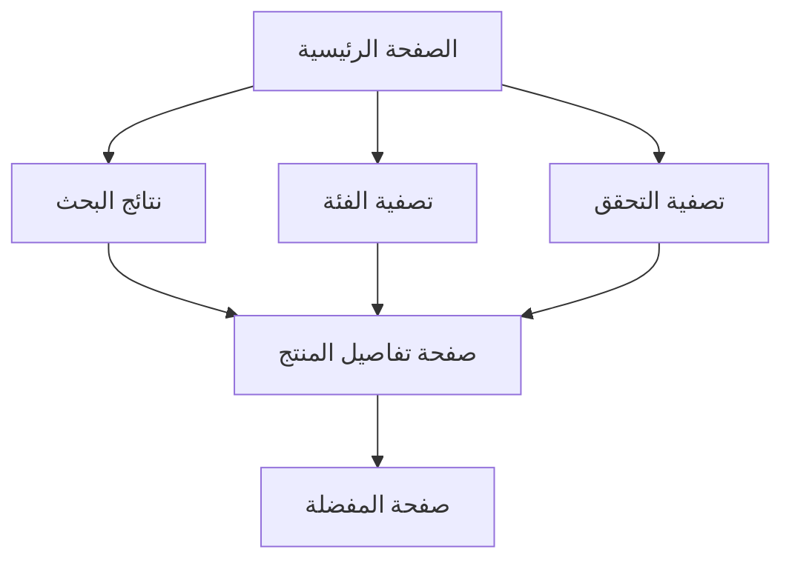

## 1. نظرة عامة على المنتج
منصة سوق إلكترونية لعرض المنتجات من واجهة برمجة التطبيقات (API) مع إمكانية التصفية حسب الفئة وحالة التحقق، مع دعم كامل للغة العربية.

المنتج يهدف إلى توفير تجربة تسوق سلسة للمستخدمين العرب، مع عرض المنتجات المعتمدة والموثوقة فقط، مما يزيد من ثقة المشترين ويحسن جودة المعاملات.

## 2. المميزات الأساسية

### 2.1 أدوار المستخدمين
| الدور | طريقة التسجيل | الصلاحيات الأساسية |
|------|----------------|------------------|
| زائر | بدون تسجيل | تصفح المنتجات، استخدام خاصية البحث والتصفية |
| مستخدم مسجل | التسجيل بالبريد الإلكتروني | حفظ المنتجات المفضلة، التعليق على المنتجات |
| بائع | التحقق من الحساب | إضافة منتجات، إدارة المخزون |
| مسؤول | تعيين من قبل النظام | التحقق من المنتجات، إدارة المستخدمين |

### 2.2 وحدة المميزات
صفحة السوق تتكون من الصفحات الرئيسية التالية:
1. **الصفحة الرئيسية**: عرض المنتجات، شريط البحث، تصفية الفئات، تصفية حالة التحقق.
2. **صفحة تفاصيل المنتج**: معلومات المنتج، صور المنتج، تقييمات المستخدمين.
3. **صفحة المفضلة**: حفظ وإدارة المنتجات المفضلة.

### 2.3 تفاصيل الصفحات
| اسم الصفحة | اسم الوحدة | وصف الميزة |
|-----------|------------|------------|
| الصفحة الرئيسية | قسم عرض المنتجات | عرض شبكي للمنتجات مع صورة، اسم، سعر، حالة التحقق |
| الصفحة الرئيسية | شريط البحث | بحث فوري بالعربية عن المنتجات |
| الصفحة الرئيسية | تصفية الفئات | قائمة منسدلة بجميع الفئات المتاحة |
| الصفحة الرئيسية | تصفية التحقق | مربع اختيار لعرض المنتجات الموثقة فقط |
| الصفحة الرئيسية | ترقيم الصفحات | تنقل بين صفحات النتائج |
| صفحة التفاصيل | معرض الصور | عرض متعدد الصور مع إمكانية التكبير |
| صفحة التفاصيل | معلومات المنتج | اسم، وصف، سعر، فئة، حالة التحقق |
| صفحة التفاصيل | قسم التقييمات | عرض تقييمات المستخدمين السابقين |
| صفحة المفضلة | قائمة المنتجات | عرض المنتجات المحفوظة مع إمكانية الحذف |

## 3. العملية الأساسية
### تدفق المستخدم العادي:
1. يدخل المستخدم إلى الصفحة الرئيسية
2. يشاهد جميع المنتجات المعروضة
3. يستخدم شريط البحث للعثور على منتج معين
4. يطبق تصفية الفئة للحصول على منتجات محددة
5. يختار تصفية "المنتجات الموثقة فقط" إذا رغب في ذلك
6. ينقر على منتج لرؤية التفاصيل
7. يمكنه حفظ المنتج في المفضلة إذا كان مسجلًا

## 4. تصميم واجهة المستخدم
### 4.1 نمط التصميم
- الألوان الأساسية: الأزرق الملكي (#1e40af) والأبيض
- الألوان الثانوية: الرمادي الفاتح (#f3f4f6) والأخضر للمنتجات الموثقة (#10b981)
- نمط الأزرار: زوايا مستديرة مع ظلال خفيفة
- الخط: Tajawal أو Cairo للغة العربية مع دعم RTL
- نمط التخطيط: شبكي مع بطاقات المنتجات
- الأيقونات: أيقونات Material Design مع دعم RTL

### 4.2 نظرة عامة على تصميم الصفحات
| اسم الصفحة | اسم الوحدة | عناصر واجهة المستخدم |
|-----------|------------|----------------------|
| الصفحة الرئيسية | قسم عرض المنتجات | شبكة منبثقة من 3 أعمدة، بطاقات بيضاء مع ظلال، صورة المنتج في الأعلى، اسم المنتج بالعربية، السعر بالريال السعودي، شارة خضراء للمنتجات الموثقة |
| الصفحة الرئيسية | شريط البحث | حقل إدخال عريض في الأعلى، أيقونة بحث على اليسار، نص توجيهي بالعربية "ابحث عن منتجك..." |
| الصفحة الرئيسية | تصفية الفئات | قائمة منسدلة على اليمين، تفتح للأسفل، ترتيب أبجدي عربي |
| صفحة التفاصيل | معرض الصور | معرض أفقي مع صور متعددة، إمكانية التكبير بالنقر، دعم swipe للموبايل |
| صفحة التفاصيل | معلومات المنتج | عنوان كبير بالعربية، وصف مفصل، سعر بارز بالريال، شارة التحقق واضحة |

### 4.3 التجاوبية
التصميم يعتمد الجوال كأولوية (mobile-first) مع دعم كامل للتفاعل باللمس، يتكيف مع الشاشات من 320px إلى 1920px، مع إعادة ترتيب العناصر تلقائيًا حسب حجم الشاشة.

### 4.4 توجيه المشهد ثلاثي الأبعاد (غير مطلوب)
لا يتطلب المنتج مشاهد ثلاثية الأبعاد.