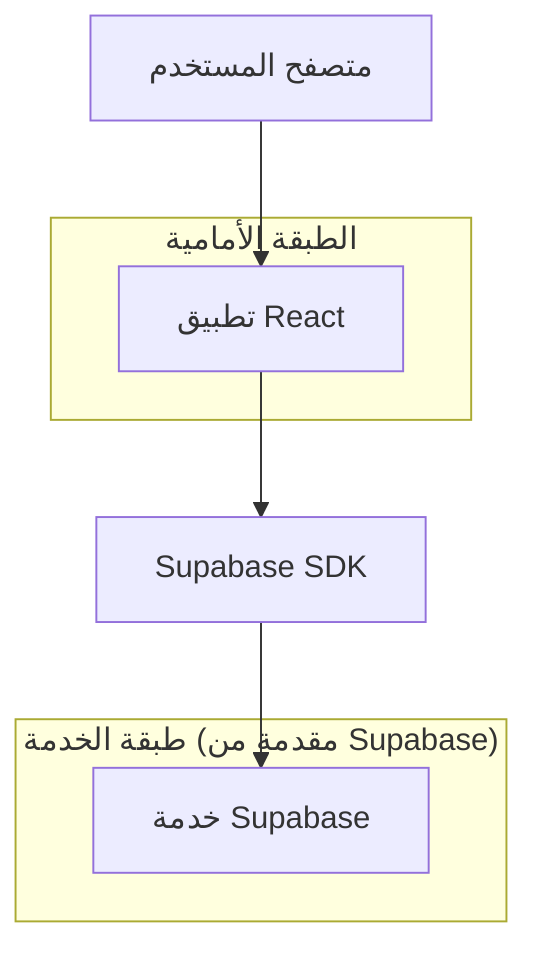
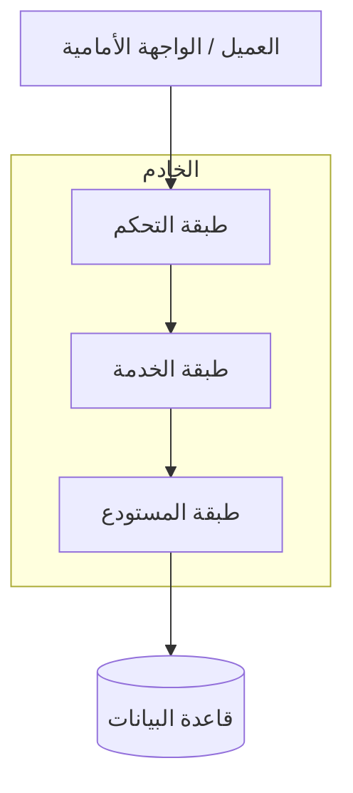
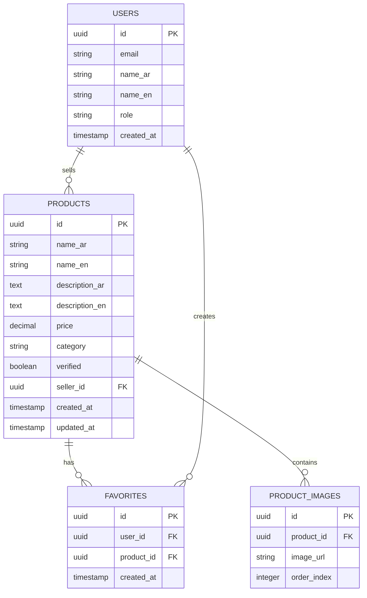

## 1. تصميم العمارة


## 2. وصف التكنولوجيا
- الواجهة الأمامية: React@18 + tailwindcss@3 + vite
- أداة التهيئة: vite-init
- الواجهة الخلفية: Supabase (PostgreSQL)
- مكتبة الاتجاه: react-rtl
- مكتبة الأيقونات: @mui/icons-material
- مكتبة الصور: react-image-gallery

## 3. تعريف المسارات
| المسار | الغرض |
|-------|--------|
| / | الصفحة الرئيسية، عرض جميع المنتجات مع خيارات التصفية |
| /product/:id | صفحة تفاصيل المنتج، عرض المعلومات الكاملة |
| /favorites | صفحة المفضلة، عرض المنتجات المحفوظة |
| /login | صفحة تسجيل الدخول |
| /register | صفحة التسجيل الجديد |

## 4. تعريف واجهة برمجة التطبيقات (API)

### 4.1 واجهة برمجة التطبيقات الأساسية

**الحصول على قائمة المنتجات**
```
GET /api/products
```

المعاملات:
| اسم المعامل | نوع المعامل | مطلوب | الوصف |
|-----------|-------------|---------|---------|
| category | string | false | تصفية حسب الفئة |
| verified | boolean | false | عرض المنتجات الموثقة فقط |
| search | string | false | نص البحث بالعربية |
| page | number | false | رقم الصفحة للترقيم |
| limit | number | false | عدد العناصر في الصفحة |

الاستجابة:
| اسم المعامل | نوع المعامل | الوصف |
|-----------|-------------|---------|
| products | array | قائمة المنتجات |
| total | number | إجمالي عدد المنتجات |
| pages | number | إجمالي عدد الصفحات |

**الحصول على تفاصيل المنتج**
```
GET /api/products/:id
```

الاستجابة:
| اسم المعامل | نوع المعامل | الوصف |
|-----------|-------------|---------|
| id | string | معرف المنتج |
| name_ar | string | اسم المنتج بالعربية |
| description_ar | string | وصف المنتج بالعربية |
| price | number | سعر المنتج |
| category | string | فئة المنتج |
| verified | boolean | حالة التحقق |
| images | array | روابط صور المنتج |
| seller_id | string | معرف البائع |

## 5. مخطط عمارة الخادم


## 6. نموذج البيانات

### 6.1 تعريف نموذج البيانات


### 6.2 لغة تعريف البيانات

**جدول المنتجات (products)**
```sql
-- إنشاء الجدول
CREATE TABLE products (
    id UUID PRIMARY KEY DEFAULT gen_random_uuid(),
    name_ar VARCHAR(255) NOT NULL,
    name_en VARCHAR(255) NOT NULL,
    description_ar TEXT,
    description_en TEXT,
    price DECIMAL(10,2) NOT NULL CHECK (price >= 0),
    category VARCHAR(100) NOT NULL,
    verified BOOLEAN DEFAULT false,
    seller_id UUID REFERENCES users(id),
    created_at TIMESTAMP WITH TIME ZONE DEFAULT NOW(),
    updated_at TIMESTAMP WITH TIME ZONE DEFAULT NOW()
);

-- إنشاء الفهارس
CREATE INDEX idx_products_category ON products(category);
CREATE INDEX idx_products_verified ON products(verified);
CREATE INDEX idx_products_seller ON products(seller_id);
CREATE INDEX idx_products_created_at ON products(created_at DESC);

-- منح الصلاحيات
GRANT SELECT ON products TO anon;
GRANT ALL PRIVILEGES ON products TO authenticated;
```

**جدول صور المنتجات (product_images)**
```sql
-- إنشاء الجدول
CREATE TABLE product_images (
    id UUID PRIMARY KEY DEFAULT gen_random_uuid(),
    product_id UUID REFERENCES products(id) ON DELETE CASCADE,
    image_url VARCHAR(500) NOT NULL,
    order_index INTEGER DEFAULT 0
);

-- إنشاء الفهرس
CREATE INDEX idx_product_images_product ON product_images(product_id);

-- منح الصلاحيات
GRANT SELECT ON product_images TO anon;
GRANT ALL PRIVILEGES ON product_images TO authenticated;
```

**جدول المستخدمين (users)**
```sql
-- إنشاء الجدول
CREATE TABLE users (
    id UUID PRIMARY KEY DEFAULT gen_random_uuid(),
    email VARCHAR(255) UNIQUE NOT NULL,
    name_ar VARCHAR(100),
    name_en VARCHAR(100),
    role VARCHAR(20) DEFAULT 'user' CHECK (role IN ('user', 'seller', 'admin')),
    created_at TIMESTAMP WITH TIME ZONE DEFAULT NOW()
);

-- منح الصلاحيات
GRANT SELECT ON users TO anon;
GRANT ALL PRIVILEGES ON users TO authenticated;
```

**جدول المفضلات (favorites)**
```sql
-- إنشاء الجدول
CREATE TABLE favorites (
    id UUID PRIMARY KEY DEFAULT gen_random_uuid(),
    user_id UUID REFERENCES users(id) ON DELETE CASCADE,
    product_id UUID REFERENCES products(id) ON DELETE CASCADE,
    created_at TIMESTAMP WITH TIME ZONE DEFAULT NOW(),
    UNIQUE(user_id, product_id)
);

-- إنشاء الفهارس
CREATE INDEX idx_favorites_user ON favorites(user_id);
CREATE INDEX idx_favorites_product ON favorites(product_id);

-- منح الصلاحيات
GRANT ALL PRIVILEGES ON favorites TO authenticated;
```

**بيانات أولية للفئات**
```sql
INSERT INTO products (name_ar, name_en, description_ar, description_en, price, category, verified, seller_id) VALUES
('هاتف ذكي', 'Smartphone', 'هاتف ذكي حديث بمواصفات عالية', 'Latest smartphone with high specs', 2500.00, 'إلكترونيات', true, gen_random_uuid()),
('لابتوب', 'Laptop', 'لابتوب للأعمال والدراسة', 'Laptop for work and study', 4500.00, 'إلكترونيات', true, gen_random_uuid()),
('ثياب رجالية', 'Men Clothing', 'ثياب رجالية أنيقة', 'Elegant men clothing', 150.00, 'أزياء', false, gen_random_uuid()),
('حقيبة يد', 'Handbag', 'حقيبة يد نسائية فاخرة', 'Luxury women handbag', 800.00, 'إكسسوارات', true, gen_random_uuid());
```