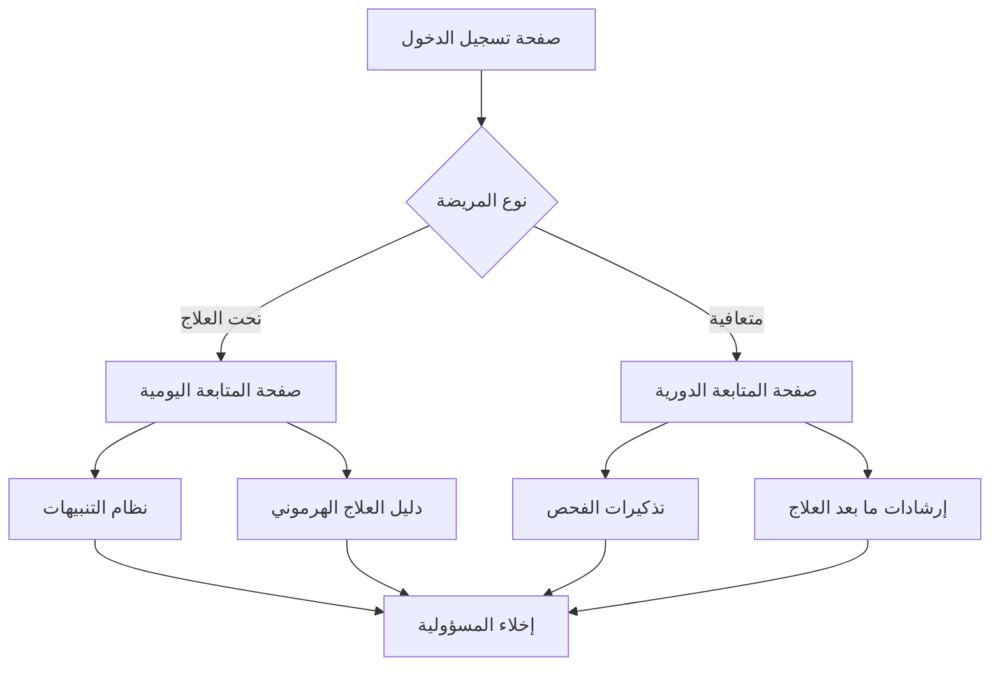

## 1. Product Overview
نظام دليل رعاية المرضى لمرضى السرطان مع التركيز على العلاج الهرموني. يوفر واجهتين منفصلتين: واحدة للمريضة تحت العلاج والأخرى للمريضة المتعافية، مع متابعة يومية وتنبيهات وإرشادات علاجية.

المنتج يهدف إلى تحسين جودة الحياة للمرضى من خلال تقديم دعم مستمر وإرشادات طبية موثوقة مع إخلاء مسؤولية طبي واضح.

## 2. Core Features

### 2.1 User Roles
| الدور | طريقة التسجيل | الصلاحيات الأساسية |
|------|----------------|------------------|
| مريضة تحت العلاج | التسجيل برقم الملف الطبي | الوصول لصفحة العلاج، تسجيل الأعراض، استلام التنبيهات |
| مريضة متعافية | الترقية من حالة العلاج أو التسجيل المباشر | الوصول لصفحة المتابعة، تسجيل الحالة، استلام التذكيرات |

### 2.2 Feature Module
يتكون دليل الرعاية من الصفحات الرئيسية التالية:
1. **صفحة المريضة تحت العلاج**: متابعة يومية، تسجيل الأعراض، جدول العلاج، تنبيهات الأدوية.
2. **صفحة المريضة المتعافية**: متابعة دورية، تذكيرات بالفحوصات، إرشادات ما بعد العلاج.

### 2.3 Page Details
| اسم الصفحة | اسم الوحدة | وصف الميزة |
|-----------|------------|------------|
| صفحة المريضة تحت العلاج | وحدة المتابعة اليومية | تسجيل الأعراض اليومية مع مقياس من 1-10 للشدة |
| صفحة المريضة تحت العلاج | نظام التنبيهات | إرسال إشعارات لمواعيد الأدوية والعلاجات |
| صفحة المريضة تحت العلاج | دليل العلاج الهرموني | عرض معلومات مفصلة عن العلاج الهرموني مع تحذيرات ومحاذير |
| صفحة المريضة تحت العلاج | إخلاء المسؤولية الطبي | عرض نص قانوني واضح بأن المعلومات للإرشاد فقط |
| صفحة المريضة المتعافية | متابعة الحالة | تسجيل الحالة الصحية الدورية |
| صفحة المريضة المتعافية | تذكيرات الفحص | إشعارات دورية لمواعيد الفحوصات الطبية |
| صفحة المريضة المتعافية | إرشادات ما بعد العلاج | نصائح للحفاظ على الصحة ومنعة الانتكاس |
| صفحة المريضة المتعافية | دعم نفسي | رابط لمجموعات الدعم والاستشارات النفسية |

## 3. Core Process
### سير عمل المريضة تحت العلاج:
1. تسجيل الدخول برقم الملف الطبي
2. الوصول لصفحة المتابعة اليومية
3. تسجيل الأعراض والآثار الجانبية
4. استلام تنبيهات الأدوية
5. قراءة إرشادات العلاج الهرموني
6. التواصل مع الطبيب عند الحاجة

### سير عمل المريضة المتعافية:
1. تسجيل الدخول أو الترقية من حالة العلاج
2. الوصول لصفحة المتابعة الدورية
3. تسجيل الحالة الصحية
4. استلام تذكيرات الفحص
5. قراءة إرشادات ما بعد العلاج
6. المشاركة في الدعم النفسي

## 4. User Interface Design
### 4.1 Design Style
- الألوان الأساسية: الأزرق الفاتح (#4A90E2) للطمأنينة والثقة
- الألوان الثانوية: الأخضر الفاتح (#7ED321) للتفاؤل والشفاء
- أسلوب الأزرار: مستديرة الحواف مع ظلال خفيفة
- الخطوط: Arial و Tahoma للغة العربية، بحجم 16px للنص الأساسي
- أسلوب التخطيط: بطاقات (Cards) مع ترتيب عمودي للمعلومات
- الرموز: أيقونات طبية بسيطة وواضحة

### 4.2 Page Design Overview
| اسم الصفحة | اسم الوحدة | عناصر واجهة المستخدم |
|-----------|------------|----------------------|
| صفحة المتابعة اليومية | نموذج التسجيل | حقول إدخال للأعراض، مقياس شدة بصري، زر حفظ بلون أخضر |
| نظام التنبيهات | قائمة الإشعارات | بطاقات بيضاء مع أيقونات ساعة، نص التنبيه، زر تم القراءة |
| دليل العلاج الهرموني | محتوى إرشادي | أقسام قابلة للطي، نصوص واضحة، تحذيرات بلون أحمر فاتح |
| إخلاء المسؤولية | منطقة قانونية | خلفية رمادية فاتحة، نص صغير، خانة اختيار للموافقة |
| صفحة المتابعة الدورية | تقويم صحي | تقويم بصري، أيقونات لحالة اليوم، زر تسجيل جديد |
| تذكيرات الفحص | بطاقات التذكير | تاريخ الفحص القادم، نوع الفحص، مكان الفحص |
| دعم نفسي | روابط مساعدة | أزرار واضحة لمجموعات الدعم، خط المساعدة، استشارات |

### 4.3 Responsiveness
التصميم يبدأ من سطح المكتب (Desktop-first) مع تكيف تلقائي للأجهزة المحمولة. يتم تحسين التفاعل باللمس للأزرار والحقول على الأجهزة اللوحية والهواتف.