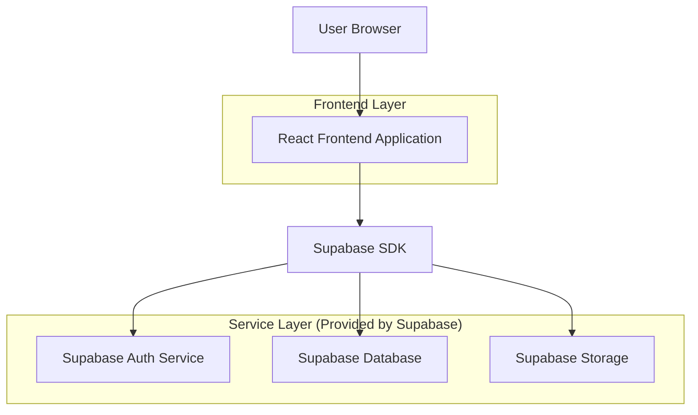
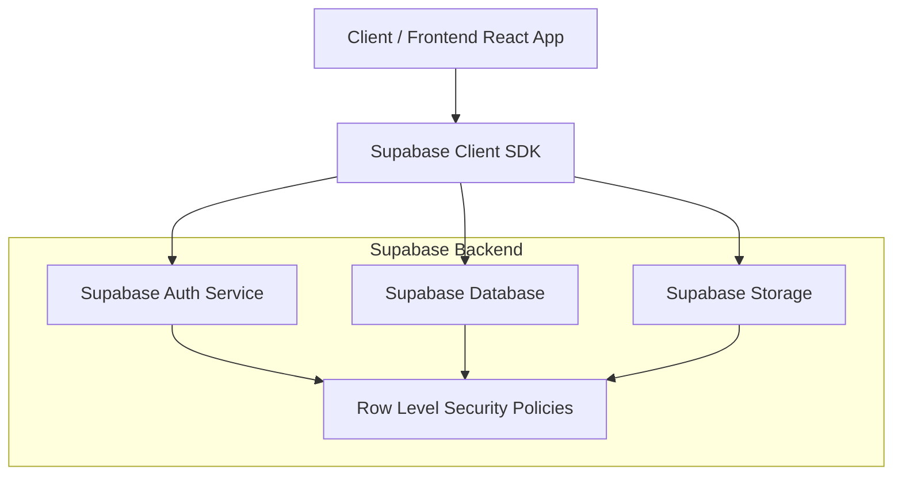
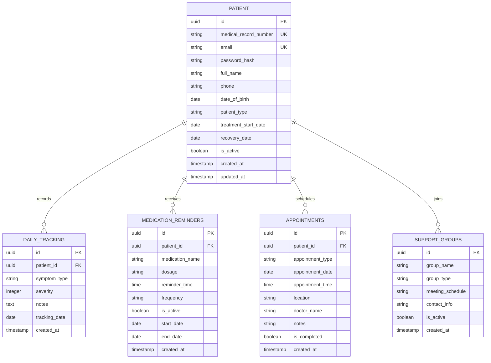

## 1.Architecture design



## 2.Technology Description
- Frontend: React@18 + tailwindcss@3 + vite
- Initialization Tool: vite-init
- Backend: Supabase (Authentication, PostgreSQL Database, File Storage)
- Additional Libraries: 
  - @supabase/supabase-js@2 (للاتصال بخدمات Supabase)
  - react-hook-form@7 (لإدارة النماذج)
  - react-hot-toast@2 (للإشعارات)
  - date-fns@2 (لإدارة التواريخ)

## 3.Route definitions
| المسار | الغرض |
|-------|--------|
| / | الصفحة الرئيسية، اختيار نوع المستخدم |
| /login | صفحة تسجيل الدخول برقم الملف الطبي |
| /patient/treatment | صفحة المريضة تحت العلاج والمتابعة اليومية |
| /patient/recovered | صفحة المريضة المتعافية والمتابعة الدورية |
| /guide/hormonal-therapy | دليل العلاج الهرموني والإرشادات |
| /disclaimer | صفحة إخلاء المسؤولية الطبي |
| /support | صفحة الدعم النفسي ومجموعات المساعدة |

## 4.API definitions

### 4.1 Authentication APIs

#### تسجيل الدخول
```
POST /auth/v1/token
```

المتغيرات:
| اسم المتغير | النوع | إلزامي | الوصف |
|-------------|--------|---------|---------|
| email | string | نعم | البريد الإلكتروني أو رقم الملف الطبي |
| password | string | نعم | كلمة المرور |

#### التحقق من الجلسة
```
GET /auth/v1/user
```

### 4.2 Database APIs

#### حفظ بيانات المتابعة اليومية
```
POST /rest/v1/daily_tracking
```

المتغيرات:
| اسم المتغير | النوع | إلزامي | الوصف |
|-------------|--------|---------|---------|
| patient_id | uuid | نعم | معرف المريضة |
| symptom_type | string | نعم | نوع العرض (ألم، غثيان، إلخ) |
| severity | integer | نعم | مقياس الشدة من 1-10 |
| notes | text | لا | ملاحظات إضافية |
| date | date | نعم | تاريخ التسجيل |

#### جدولة التنبيهات
```
POST /rest/v1/medication_reminders
```

المتغيرات:
| اسم المتغير | النوع | إلزامي | الوصف |
|-------------|--------|---------|---------|
| patient_id | uuid | نعم | معرف المريضة |
| medication_name | string | نعم | اسم الدواء |
| dosage | string | نعم | الجرعة |
| reminder_time | time | نعم | وقت التذكير |
| frequency | string | نعم | التكرار (يومي، أسبوعي) |

## 5.Server architecture diagram



## 6.Data model

### 6.1 Data model definition



### 6.2 Data Definition Language

#### جدول المرضى (patients)
```sql
-- إنشاء الجدول
CREATE TABLE patients (
    id UUID PRIMARY KEY DEFAULT gen_random_uuid(),
    medical_record_number VARCHAR(50) UNIQUE NOT NULL,
    email VARCHAR(255) UNIQUE NOT NULL,
    password_hash VARCHAR(255) NOT NULL,
    full_name VARCHAR(100) NOT NULL,
    phone VARCHAR(20),
    date_of_birth DATE,
    patient_type VARCHAR(20) DEFAULT 'under_treatment' CHECK (patient_type IN ('under_treatment', 'recovered')),
    treatment_start_date DATE,
    recovery_date DATE,
    is_active BOOLEAN DEFAULT true,
    created_at TIMESTAMP WITH TIME ZONE DEFAULT NOW(),
    updated_at TIMESTAMP WITH TIME ZONE DEFAULT NOW()
);

-- إنشاء الفهارس
CREATE INDEX idx_patients_medical_record ON patients(medical_record_number);
CREATE INDEX idx_patients_patient_type ON patients(patient_type);
CREATE INDEX idx_patients_is_active ON patients(is_active);

-- منح الصلاحيات
GRANT SELECT ON patients TO anon;
GRANT ALL PRIVILEGES ON patients TO authenticated;
```

#### جدول المتابعة اليومية (daily_tracking)
```sql
-- إنشاء الجدول
CREATE TABLE daily_tracking (
    id UUID PRIMARY KEY DEFAULT gen_random_uuid(),
    patient_id UUID REFERENCES patients(id) ON DELETE CASCADE,
    symptom_type VARCHAR(50) NOT NULL,
    severity INTEGER CHECK (severity >= 1 AND severity <= 10),
    notes TEXT,
    tracking_date DATE NOT NULL,
    created_at TIMESTAMP WITH TIME ZONE DEFAULT NOW()
);

-- إنشاء الفهارس
CREATE INDEX idx_daily_tracking_patient_id ON daily_tracking(patient_id);
CREATE INDEX idx_daily_tracking_date ON daily_tracking(tracking_date);
CREATE INDEX idx_daily_tracking_symptom ON daily_tracking(symptom_type);

-- منح الصلاحيات
GRANT SELECT ON daily_tracking TO anon;
GRANT ALL PRIVILEGES ON daily_tracking TO authenticated;

-- سياسات الأمان
CREATE POLICY "المرضى يمكنهم رؤية سجلاتهم فقط" ON daily_tracking
    FOR SELECT USING (auth.uid() = patient_id);

CREATE POLICY "المرضى يمكنهم إضافة سجلات لأنفسهم" ON daily_tracking
    FOR INSERT WITH CHECK (auth.uid() = patient_id);
```

#### جدول تنبيهات الأدوية (medication_reminders)
```sql
-- إنشاء الجدول
CREATE TABLE medication_reminders (
    id UUID PRIMARY KEY DEFAULT gen_random_uuid(),
    patient_id UUID REFERENCES patients(id) ON DELETE CASCADE,
    medication_name VARCHAR(100) NOT NULL,
    dosage VARCHAR(50) NOT NULL,
    reminder_time TIME NOT NULL,
    frequency VARCHAR(20) DEFAULT 'daily' CHECK (frequency IN ('daily', 'weekly', 'monthly')),
    is_active BOOLEAN DEFAULT true,
    start_date DATE DEFAULT CURRENT_DATE,
    end_date DATE,
    created_at TIMESTAMP WITH TIME ZONE DEFAULT NOW()
);

-- إنشاء الفهارس
CREATE INDEX idx_medication_patient_id ON medication_reminders(patient_id);
CREATE INDEX idx_medication_active ON medication_reminders(is_active);
CREATE INDEX idx_medication_frequency ON medication_reminders(frequency);

-- منح الصلاحيات
GRANT SELECT ON medication_reminders TO anon;
GRANT ALL PRIVILEGES ON medication_reminders TO authenticated;
```

#### جدول المواعيد الطبية (appointments)
```sql
-- إنشاء الجدول
CREATE TABLE appointments (
    id UUID PRIMARY KEY DEFAULT gen_random_uuid(),
    patient_id UUID REFERENCES patients(id) ON DELETE CASCADE,
    appointment_type VARCHAR(50) NOT NULL,
    appointment_date DATE NOT NULL,
    appointment_time TIME,
    location VARCHAR(200),
    doctor_name VARCHAR(100),
    notes TEXT,
    is_completed BOOLEAN DEFAULT false,
    created_at TIMESTAMP WITH TIME ZONE DEFAULT NOW()
);

-- إنشاء الفهارس
CREATE INDEX idx_appointments_patient_id ON appointments(patient_id);
CREATE INDEX idx_appointments_date ON appointments(appointment_date);
CREATE INDEX idx_appointments_completed ON appointments(is_completed);

-- منح الصلاحيات
GRANT SELECT ON appointments TO anon;
GRANT ALL PRIVILEGES ON appointments TO authenticated;
```

#### البيانات الأولية لمجموعات الدعم
```sql
-- إدخال بيانات مجموعات الدعم
INSERT INTO support_groups (group_name, group_type, meeting_schedule, contact_info, is_active) VALUES
('مجموعة دعم المرضى الجدد', 'new_patients', 'كل أحد الساعة 6 مساءً', 'info@support.com', true),
('مجموعة دعم المتعافيات', 'recovered', 'كل أربعاء الساعة 7 مساءً', 'recovered@support.com', true),
('مجموعة دعم الأسرة', 'family', 'كل جمعة الساعة 5 مساءً', 'family@support.com', true),
('استشارات نفسية فردية', 'individual', 'حسب المواعيد', 'psych@support.com', true);
```