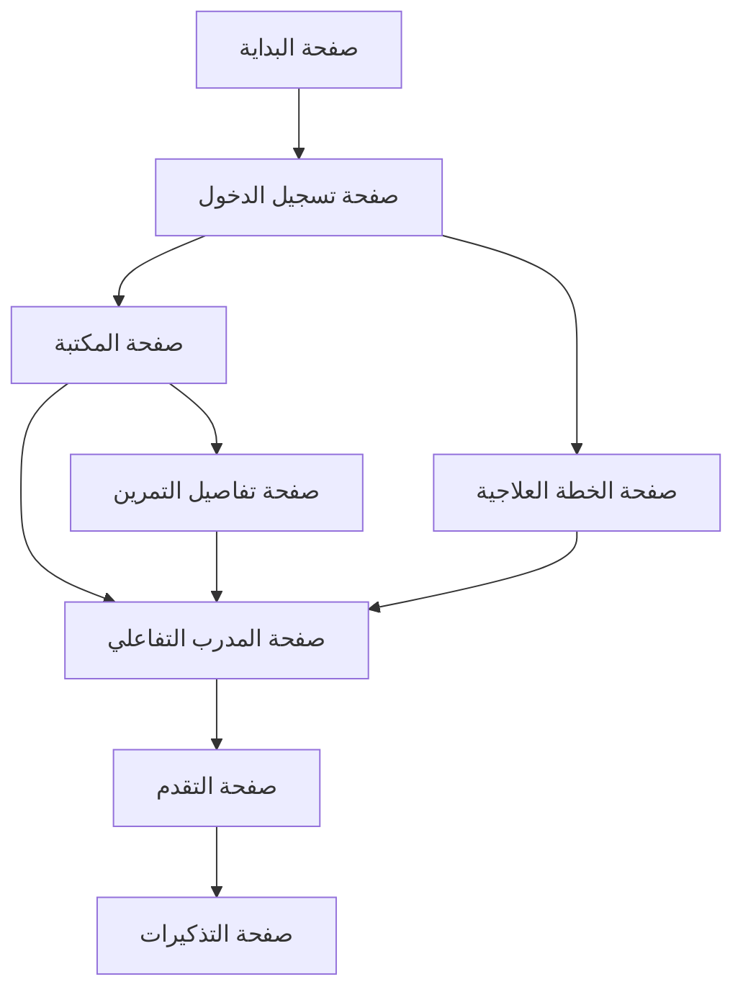

## 1. نظرة عامة على المنتج
منصة تمارين علاج طبيعي رقمية توفر مكتبة شاملة من التمارين المصورة مع مدرب تفاعلي بالكاميرا، وتتبع للتقدم، وتذكيرات ذكية. تهدف إلى مساعدة المرضى على أداء التمارين بشكل صحيح ومنتظم أثناء فترة التعافي.

- تحل مشكلة: صعوبة تذكر التمارين وعدم التأكد من أدائها بشكل صحيح
- المستخدمون: المرضى المحالون للعلاج الطبيعي، كبار السن، الرياضيون
- القيمة: تحسين الالتزام بالتمارين وتقليل خطر الإصابة من خلال التوجيه الصحيح

## 2. الميزات الأساسية

### 2.1 أدوار المستخدمين

| الدور | طريقة التسجيل | الصلاحيات الأساسية |
|------|----------------|---------------------|
| مريض | التسجيل بالبريد الإلكتروني أو رقم الهاتف | تصفح التمارين، أداء التمارين، تتبع التقدم |
| معالج طبيعي | التسجيل برقم الترخيص المهني | إنشاء خطط تمارين، مراقبة تقدم المرضى |
| مشرف | دعوة من الإدارة | إدارة التمارين، مراجعة التقارير |

### 2.2 وحدات الميزات

يتكون قسم تمارين العلاج الطبيعي من الصفحات الرئيسية التالية:
1. **صفحة المكتبة**: مكتبة التمارين المصورة مع فئات الجسم والصعوبة
2. **صفحة المدرب التفاعلي**: تدريب مباشر بالكاميرا مع تحليل الحركة
3. **صفحة التقدم**: لوحة معلومات التقدم والإحصائيات الشخصية
4. **صفحة التذكيرات**: إعداد وتعديل التذكيرات اليومية والأسبوعية
5. **صفحة الخطة العلاجية**: خطة التمارين المخصصة من المعالج

### 2.3 تفاصيل الصفحات

| اسم الصفحة | اسم الوحدة | وصف الميزة |
|------------|------------|------------|
| مكتبة التمارين | تصفح التمارين | تصفح التمارين حسب جزء الجسم، نوع الإصابة، مستوى الصعوبة |
| مكتبة التمارين | فيديوهات توضيحية | مشاهدة فيديوهات عالية الجودة مع تعليمات صوتية واضحة |
| مكتبة التمارين | تفاصيل التمرين | عرض خطوات التمرين، عدد التكرارات، التحذيرات، الفوائد |
| المدرب التفاعلي | كشف الحركة | استخدام الكاميرا لتحليل حركة المستخدم أثناء التمرين |
| المدرب التفاعلي | تصحيح وضعية | تقديم ملاحظات فورية عن صحة وضعية الجسم والأداء |
| المدرب التفاعلي | عداد التكرارات | عد التكرارات تلقائياً باستخدام الذكاء الاصطناعي |
| تتبع التقدم | لوحة المعلومات | عرض إحصائيات الأداء، عدد التمارين المكتملة، أيام الالتزام |
| تتبع التقدم | الرسوم البيانية | عرض التقدم البيئي لمدة أسبوع، شهر، 3 أشهر |
| تتبع التقدم | تقارير الأداء | إنشاء تقارير دورية لإرسالها للمعالج الطبيعي |
| التذكيرات | جدولة التذكيرات | إعداد تذكيرات مخصصة لكل تمرين مع أوقات محددة |
| التذكيرات | إشعارات الدفع | إشعارات للهاتف والبريد الإلكتروني بتذكيرات التمارين |
| التذكيرات | سجل الالتزام | تسجيل أيام أداء التمارين مع ملاحظات |
| الخطة العلاجية | خطة مخصصة | عرض الخطة العلاجية الموصى بها من المعالج |
| الخطة العلاجية | تعديل الصعوبة | تعديل مستوى الصعوبة حسب التقدم والقدرة |
| إخلاء المسؤولية | تحذير طبي | عرض تحذير طبي واضح قبل بدء أي تمرين |
| إخلاء المسؤولية | موافقة المستخدم | الحصول على موافقة صريحة من المستخدم قبل البدء |

## 3. العمليات الأساسية

### تدفق المريض الأساسي:
1. التسجيل في التطبيق والموافقة على إخلاء المسؤولية الطبي
2. تصفح مكتبة التمارين أو استلام خطة علاجية من المعالج
3. اختيار تمرين مناسب ومشاهدة الفيديو التوضيحي
4. البدء في وضع المدرب التفاعلي مع الكاميرا
5. أداء التمرين مع تلقي ملاحظات فورية
6. تسجيل إتمام التمرين والتقدم
7. تلقي تذكيرات بالتمارين القادمة

### تدفق المعالج الطبيعي:
1. التسجيل والتحقق من الترخيص المهني
2. إنشاء خطط تمارين مخصصة للمرضى
3. مراقبة تقدم المرضى وتعديل الخطط
4. مراجعة التقارير والتواصل مع المرضى

## 4. تصميم واجهة المستخدم

### 4.1 أسلوب التصميم
- الألوان الأساسية: الأزرق الطبي (#0066CC) والأخضر المطمئن (#00AA44)
- الألوان الثانوية: الرمادي الفاتح (#F5F5F5) والأبيض النقي (#FFFFFF)
- أزرار التصميم: مستديرة الحواف بنسبة 8px مع ظلال خفيفة
- الخطوط: Arial أو Tahoma بحجم 16px للنص الأساسي، 20px للعناوين
- أسلوب التخطيط: تصميم قائم على البطاقات مع مسافات بيضاء وافية
- الرموز: استخدام رموز طبية واضحة ومعتمدة مثل +، ❤️، ✅

### 4.2 نظرة عامة على تصميم الصفحات

| اسم الصفحة | اسم الوحدة | عناصر واجهة المستخدم |
|------------|------------|----------------------|
| مكتبة التمارين | شريط البحث | حقل بحث كبير مع أيقونة عدسة، تصفية حسب الجزء والصعوبة |
| مكتبة التمارين | شبكة التمارين | بطاقات عرض مع صورة التمرين، الاسم، عدد التكرارات، تقييم |
| المدرب التفاعلي | منطقة الكاميرا | منطقة عرض كبيرة للكاميرا مع إرشادات الوضعية |
| المدرب التفاعلي | لوحة التحكم | أزرار بدء/إيقاف، عداد التكرارات، مؤشر التقدم |
| تتبع التقدم | إحصائيات الأسبوع | رسم بياني خطي للتمارين المكتملة، حلقات التقدم |
| تتبع التقدم | بطاقات الإنجاز | بطاقات ملونة تعرض الإنجازات والأهداف المكتملة |
| التذكيرات | قائمة التذكيرات | قائمة منسدلة مع أوقات التذكير، أيقونات التمرين |
| إخلاء المسؤولية | نافذة منبثقة | نافذة كبيرة مع تحذير طبي واضح، زر "أوافق" بارز |

### 4.3 التصميم المتجاوب
- التصميم الأساسي: سطح المكتب أولاً مع التكيف مع الجوال
- الشاشات المدعومة: 1920x1080 (سطح المكتب)، 768x1024 (تابلت)، 375x667 (موبايل)
- التفاعل مع اللمس: تحسين الأزرار والمناطق القابلة للنقر لسهولة الاستخدام على الأجهزة اللوحية

### 4.4 إرشادات المشهد ثلاثي الأبعاد (للمدرب التفاعلي)
- البيئة: خلفية بيضاء نظيفة مع إضاءة محايدة لتقليل التشويش
- الإضاءة: إضاءة أمامية ناعمة مع إضاءة خلفية خفيفة لتمييز轮廓 الجسم
- الكاميرا: موضع أمامي مباشر، زاوية رؤية 75 درجة، ارتفاع مناسب لرؤية الجسم الكامل
- التركيب: التركيز على وضعية الجسم والحركات، مع إرشادات مرئية للوضعية الصحيحة
- التفاعل: خطوط توجيه حمراء/خضراء لتحديد الخطأ/الصواب في الوضعية
- معالجة ما بعد التصوير: تأثير Bloom خفيف على مناطق التركيز، تباين محسن لرؤية أوضح