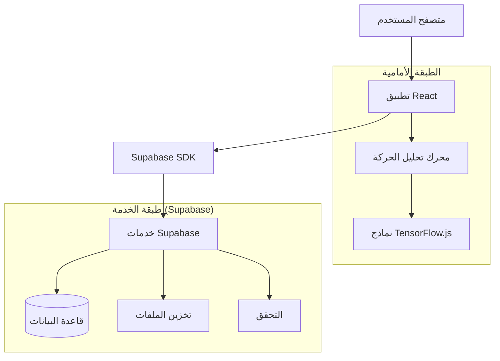
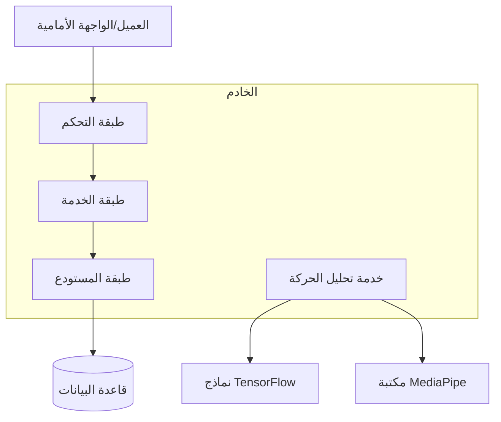
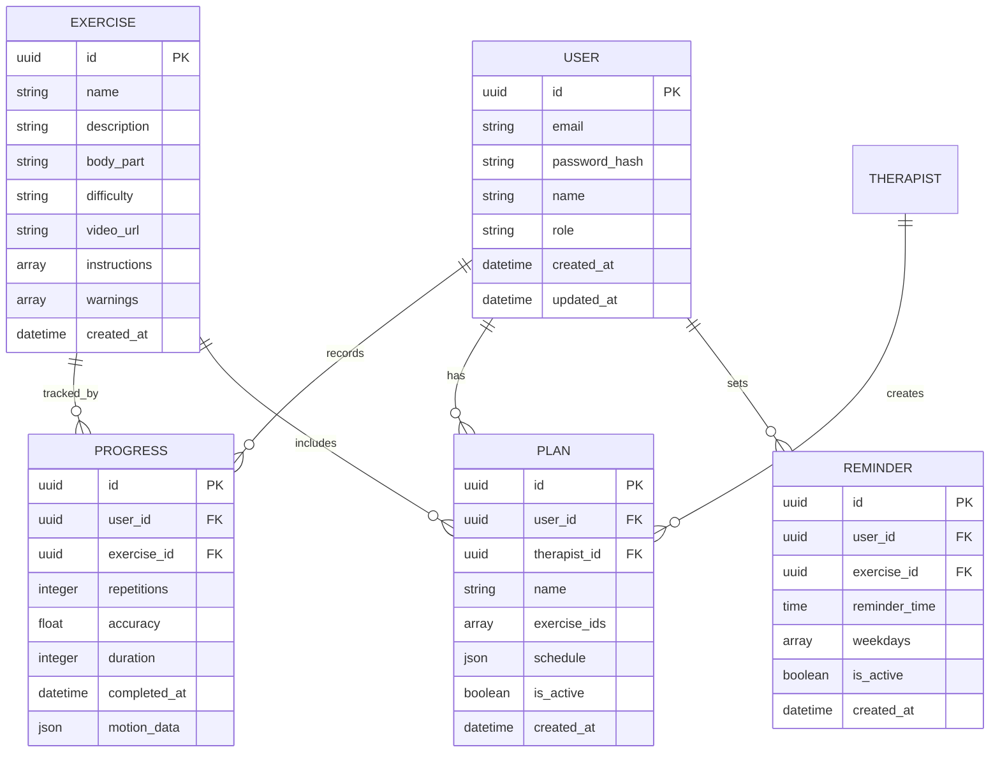

## 1. تصميم البنية التحتية



## 2. وصف التكنولوجيا

- الواجهة الأمامية: React@18 + tailwindcss@3 + vite
- أداة التهيئة: vite-init
- الخدمة الخلفية: Supabase
- مكتبات الذكاء الاصطناعي: TensorFlow.js@4 + MediaPipe@0.10
- مكتبة الكاميرا: react-camera-pro@1.4
- إدارة الحالة: Zustand@4.5

## 3. تعريف المسارات

| المسار | الغرض |
|--------|--------|
| / | الصفحة الرئيسية، عرض مكتبة التمارين |
| /exercise/:id | صفحة تفاصيل التمرين مع الفيديو |
| /trainer/:id | صفحة المدرب التفاعلي مع الكاميرا |
| /progress | صفحة تتبع التقدم والإحصائيات |
| /reminders | صفحة إعداد التذكيرات |
| /plan | صفحة الخطة العلاجية المخصصة |
| /disclaimer | صفحة إخلاء المسؤولية الطبي |
| /login | صفحة تسجيل الدخول |
| /register | صفحة إنشاء حساب جديد |

## 4. تعريف واجهات برمجة التطبيقات

### 4.1 واجهات المصادقة

```
POST /api/auth/register
```

الطلب:
| اسم المعامل | نوع المعامل | مطوب | الوصف |
|-------------|-------------|--------|-------------|
| email | string | نعم | البريد الإلكتروني للمستخدم |
| password | string | نعم | كلمة المرور |
| name | string | نعم | الاسم الكامل |
| role | string | نعم | نوع المستخدم (patient/therapist) |
| license_number | string | لا | رقم الترخيص للمعالجين |

الاستجابة:
| اسم المعامل | نوع المعامل | الوصف |
|-------------|-------------|-------------|
| user | object | بيانات المستخدم الجديد |
| session | object | جلسة تسجيل الدخول |

### 4.2 واجهات التمارين

```
GET /api/exercises
```

الاستجابة:
| اسم المعامل | نوع المعامل | الوصف |
|-------------|-------------|-------------|
| exercises | array[] | قائمة التمارين مع التفاصيل |
| categories | array[] | فئات التمارين |

```
GET /api/exercises/:id
```

الاستجابة:
| اسم المعامل | نوع المعامل | الوصف |
|-------------|-------------|-------------|
| exercise | object | تفاصيل التمرين الكاملة |
| video_url | string | رابط فيديو التمرين |
| instructions | array[] | خطوات التمرين |

### 4.3 واجهات التقدم

```
POST /api/progress/track
```

الطلب:
| اسم المعامل | نوع المعامل | مطوب | الوصف |
|-------------|-------------|--------|-------------|
| exercise_id | string | نعم | معرف التمرين |
| repetitions | number | نعم | عدد التكرارات المكتملة |
| accuracy | number | نعم | نسبة دقة الأداء |
| duration | number | نعم | مدة أداء التمرين بالثواني |
| completed_at | datetime | نعم | وقت إتمام التمرين |

## 5. مخطط بنية الخادم



## 6. نموذج البيانات

### 6.1 تعريف نموذج البيانات



### 6.2 لغة تعريف البيانات

جدول المستخدمين (users)
```sql
-- إنشاء الجدول
CREATE TABLE users (
    id UUID PRIMARY KEY DEFAULT gen_random_uuid(),
    email VARCHAR(255) UNIQUE NOT NULL,
    password_hash VARCHAR(255) NOT NULL,
    name VARCHAR(100) NOT NULL,
    role VARCHAR(20) DEFAULT 'patient' CHECK (role IN ('patient', 'therapist', 'admin')),
    license_number VARCHAR(50),
    created_at TIMESTAMP WITH TIME ZONE DEFAULT NOW(),
    updated_at TIMESTAMP WITH TIME ZONE DEFAULT NOW()
);

-- إنشاء الفهارس
CREATE INDEX idx_users_email ON users(email);
CREATE INDEX idx_users_role ON users(role);
```

جدول التمارين (exercises)
```sql
-- إنشاء الجدول
CREATE TABLE exercises (
    id UUID PRIMARY KEY DEFAULT gen_random_uuid(),
    name VARCHAR(255) NOT NULL,
    description TEXT NOT NULL,
    body_part VARCHAR(50) NOT NULL,
    difficulty VARCHAR(20) CHECK (difficulty IN ('beginner', 'intermediate', 'advanced')),
    video_url VARCHAR(500),
    instructions JSONB NOT NULL,
    warnings JSONB,
    duration_seconds INTEGER DEFAULT 60,
    repetitions INTEGER DEFAULT 10,
    created_at TIMESTAMP WITH TIME ZONE DEFAULT NOW()
);

-- إنشاء الفهارس
CREATE INDEX idx_exercises_body_part ON exercises(body_part);
CREATE INDEX idx_exercises_difficulty ON exercises(difficulty);
```

جدول التقدم (progress)
```sql
-- إنشاء الجدول
CREATE TABLE progress (
    id UUID PRIMARY KEY DEFAULT gen_random_uuid(),
    user_id UUID REFERENCES users(id) ON DELETE CASCADE,
    exercise_id UUID REFERENCES exercises(id) ON DELETE CASCADE,
    repetitions INTEGER NOT NULL,
    accuracy DECIMAL(5,2) CHECK (accuracy >= 0 AND accuracy <= 100),
    duration_seconds INTEGER NOT NULL,
    motion_data JSONB,
    completed_at TIMESTAMP WITH TIME ZONE DEFAULT NOW()
);

-- إنشاء الفهارس
CREATE INDEX idx_progress_user_id ON progress(user_id);
CREATE INDEX idx_progress_exercise_id ON progress(exercise_id);
CREATE INDEX idx_progress_completed_at ON progress(completed_at DESC);
```

### 6.3 سياسات الأمان والوصول

-- منح صلاحيات الوصول للمستخدمين غير المسجلين
```sql
GRANT SELECT ON exercises TO anon;
GRANT SELECT ON users TO anon;

-- منح صلاحيات كاملة للمستخدمين المسجلين
GRANT ALL PRIVILEGES ON exercises TO authenticated;
GRANT ALL PRIVILEGES ON progress TO authenticated;
GRANT ALL PRIVILEGES ON users TO authenticated;
```

-- سياسات مستوى الصف (Row Level Security)
```sql
-- تمكين RLS
ALTER TABLE progress ENABLE ROW LEVEL SECURITY;
ALTER TABLE users ENABLE ROW LEVEL SECURITY;

-- سياسة التقدم: يمكن للمستخدمين فقط رؤية تقدمهم الخاص
CREATE POLICY "Users can view own progress" ON progress
    FOR SELECT USING (auth.uid() = user_id);

-- سياسة التقدم: يمكن للمستخدمين فقط تعديل تقدمهم الخاص
CREATE POLICY "Users can update own progress" ON progress
    FOR ALL USING (auth.uid() = user_id);

-- سياسة المستخدمين: يمكن للمستخدمين فقط تعديل بياناتهم الخاصة
CREATE POLICY "Users can update own profile" ON users
    FOR ALL USING (auth.uid() = id);
```

### 6.4 البيانات الأولية

```sql
-- إدراج تمارين أساسية
INSERT INTO exercises (name, description, body_part, difficulty, video_url, instructions, warnings, duration_seconds, repetitions) VALUES
('تمرين رفع الذراع', 'تمرين بسيط لتحسين حركة الكتف والذراع', 'shoulder', 'beginner', 'videos/shoulder_raise.mp4', 
 '["قف بشكل مستقيم", "ارفع ذراعك ببطء إلى الأعلى", "استمر لمدة 5 ثوانٍ", "أنزل ذراعك ببطء"]', 
 '["تجنب الألم الشديد", "لا ترفع الذراع فوق مستوى الكتف إذا كان مؤلماً"]', 60, 10),

('تمرين ثني الركبة', 'تمرين لتقوية عضلات الفخذ والركبة', 'knee', 'beginner', 'videos/knee_bend.mp4',
 '["اجلس على كرسي", "ثني ركبتك ببطء", "استمر لمدة 3 ثوانٍ", "أعد الرجل إلى الوضع الأصلي"]', 
 '["تجنب الثني الكامل إذا كان مؤلماً", "احتفظ بالقدم على الأرض"]', 45, 15),

('تمرين تمطية الظهر', 'تمرين لتخفيف توتر عضلات الظهر', 'back', 'intermediate', 'videos/back_stretch.mp4',
 '["استلق على ظهرك", "اجذب ركبتيك إلى صدرك", "استمر لمدة 10 ثوانٍ", "كرر التمرين"]', 
 '["تجنب التمرين إذا كان هناك ألم حاد", "تحرك ببطء وبحذر"]', 90, 8);
```